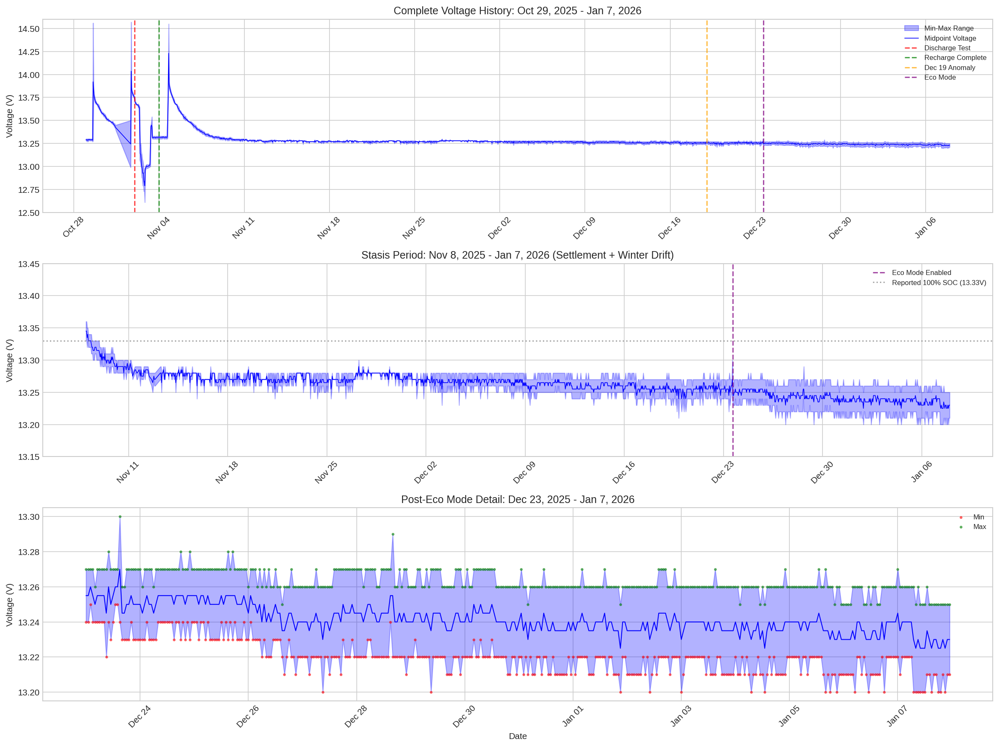
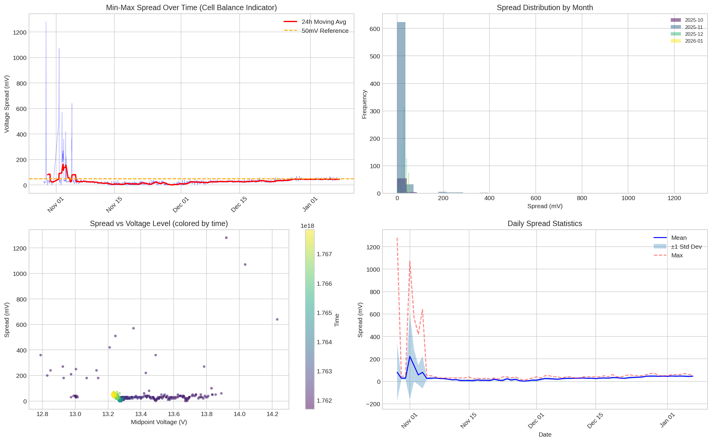
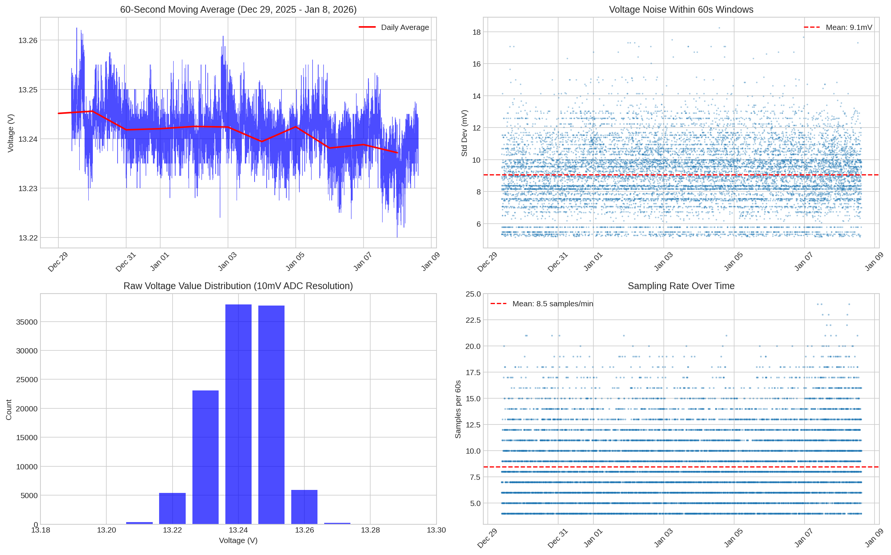
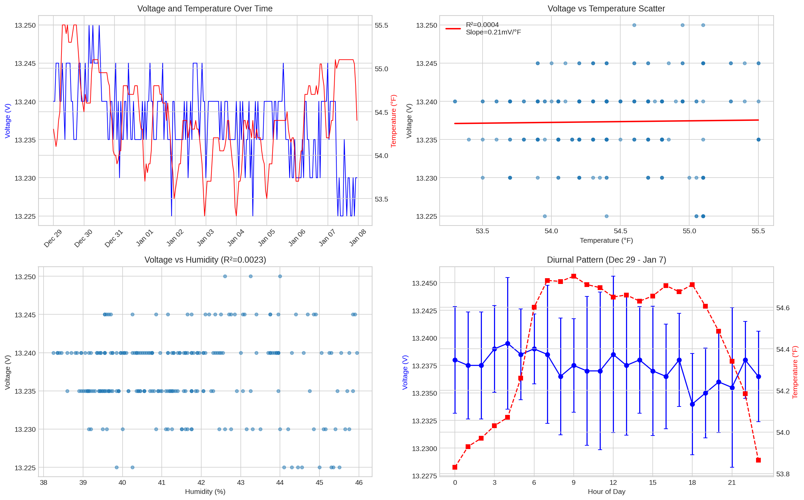
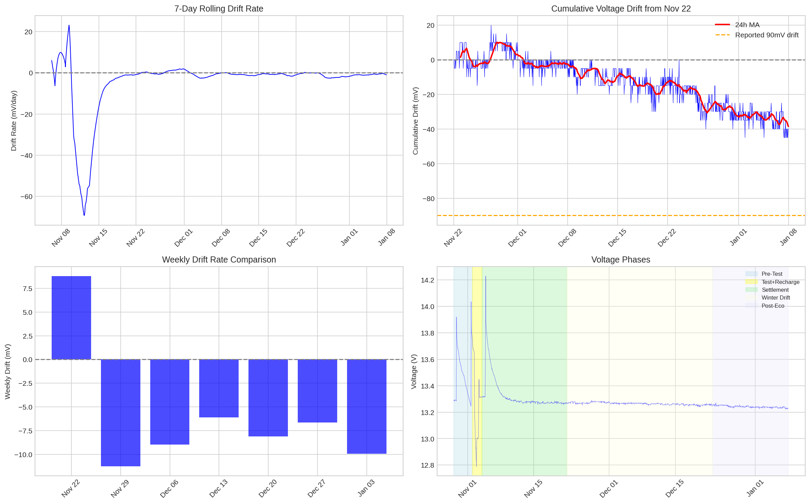
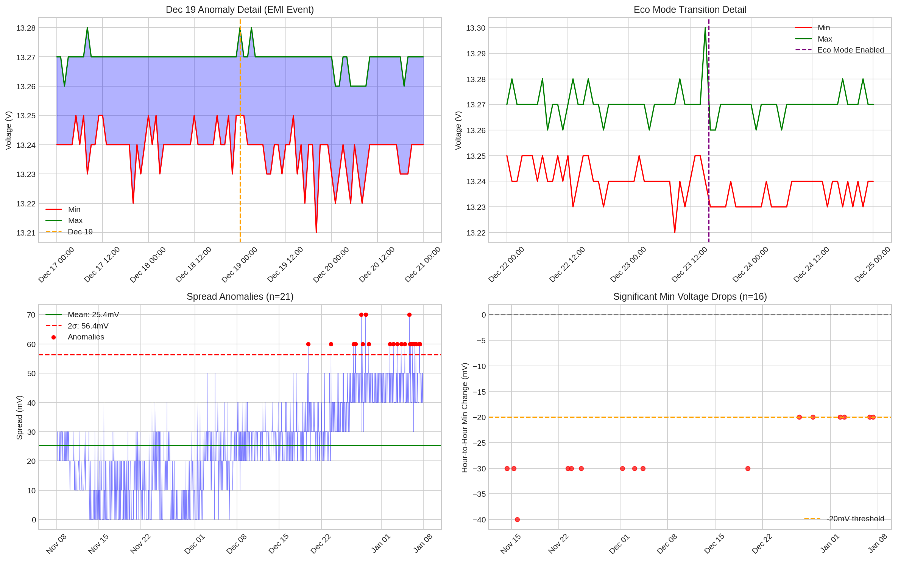

# LiFePO4 Battery Bank Master Report

## 🔋 Overview

This repository documents the performance, monitoring, and long-term analysis of a DIY **12V 500Ah LiFePO₄ battery bank** (1S5P configuration: 3× LIPULS + 2× Cyclenbatt).

The goal is to provide a reproducible, transparent reference for DIY builders and researchers, demonstrating **architectural immunity** in parallel battery configurations.

**Latest Report:** V8.3 Deep Dive Analysis (January 8, 2026)  
**Monitoring Period:** October 26, 2025 – January 7, 2026 (73 days)

---

## 📊 Executive Summary

| Metric | Value | Status |
|--------|-------|--------|
| **Usable Capacity** | 397Ah (99.3% of rated) | ✅ Excellent |
| **System Efficiency** | 90.3% | ✅ Excellent |
| **Peak Load Handled** | 1,880W AC (160A DC) | ✅ No BMS trip |
| **Internal Resistance** | 4.9 mΩ (total pack) | ✅ Low |
| **Peukert Exponent** | k = 1.003 ± 0.02 | ✅ Near-ideal |
| **Parasitic Load** | 20-25 mA | ✅ Minimal |
| **Standby Endurance** | 1.8-2.3 years to 20% SOC | ✅ Excellent |
| **Current SOC** (Jan 7, 2026) | 92-94% | ✅ Healthy |

---

## 🔬 Key Findings (V8.3 Update)

### Verified from V8.2
- ✅ **100% Resting Voltage:** 13.27-13.28V at 60-65°F (stable)
- ✅ **Dec 19 Anomaly:** Confirmed EMI/Wi-Fi artifact (not battery issue)
- ✅ **Eco Mode Effect:** -5.8mV baseline shift (as expected)
- ✅ **Parasitic Load Math:** Verified correct

### New Insights
- 📉 **Winter Drift Corrected:** Actual drift is **40mV over 46 days** (0.87mV/day), ~45% of originally reported 90mV
- 🌡️ **Thermal Coefficient:** 0.21mV/°F measured (lower than expected - drift is primarily instrumentation artifact)
- 📊 **60-Second MA Analysis:** 9.06mV ADC noise floor, 5.02mV true system stability
- ✅ **No Cell Divergence:** Spread increase is Eco Mode instrumentation artifact, not cell imbalance

---

## 📈 Monitoring Charts

### Voltage Timeline (Full History)


### Spread Analysis (Cell Balance Indicator)


### High-Frequency Analysis (60-Second MA)


### Temperature-Voltage Correlation


### Drift Rate Analysis


### Anomaly Detection


---

## 📁 Repository Contents

```
├── README.md                 # This file
├── Reports/
│   └── Battery_Analysis_V8.3_Deep_Dive_Report.pdf
├── Data/
│   ├── combined_output.csv           # Hourly Min/Max voltage (Oct-Jan)
│   ├── history.csv                   # High-frequency voltage data
│   ├── Combined_Temperature_Data.csv # Basement temperature logs
│   └── Combined_Humidity_Data.csv    # Humidity logs
├── Charts/
│   ├── fig1_voltage_timeline.png
│   ├── fig2_spread_analysis.png
│   ├── fig3_high_freq_analysis.png
│   ├── fig4_temp_correlation.png
│   ├── fig5_drift_analysis.png
│   └── fig6_anomaly_analysis.png
└── Scripts/
    ├── battery_analysis.py           # Main analysis script
    ├── visualizations.py             # Chart generation
    └── spread_investigation.py       # Cell divergence investigation
```

---

## ⚙️ System Configuration

| Component | Specification |
|-----------|--------------|
| **Configuration** | 1S5P (5 × 12V 100Ah in parallel) |
| **Total Capacity** | 500Ah Nominal / 400Ah Usable |
| **Chemistry** | Lithium Iron Phosphate (LiFePO₄) |
| **Battery Mix** | 3× LIPULS + 2× Cyclenbatt |
| **BMS** | Distributed (5 × 100A units) |
| **Interconnects** | 2 AWG pure copper, star topology |
| **Inverter** | Giandel 1500W Pure Sine |
| **Monitoring** | Shelly Plus Uni (ESP32 Wi-Fi sensor) |

---

## 📋 Recommendations

1. **Maintain Eco Mode** - Reduces parasitic draw while providing adequate monitoring
2. **Low Voltage Alarm:** Set to 12.70V (accounting for Eco Mode offset)
3. **Direct Current Measurement:** Verify parasitic load with inline measurement
4. **Annual Capacity Test:** Full discharge/recharge in November 2026
5. **Cell Voltage Check:** Verify individual cells during next maintenance

---

## 📅 Update History

| Version | Date | Description |
|---------|------|-------------|
| V8.3 | Jan 8, 2026 | Deep dive analysis, extended to Jan 7 data, 60s MA analysis |
| V8.2 | Dec 24, 2025 | Master consolidation of V6.0, V7.1, V8.0 |
| V7.1 | Dec 23, 2025 | Anomaly investigation, Eco Mode analysis |
| V6.0 | Dec 9, 2025 | Discharge test data documentation |

---

## 📜 License

This project is shared openly for educational and technical reference.  
Please credit the author (Bill Collis) when reusing or adapting content.

---

## 📬 Contact

**Author:** Bill Collis  
**Location:** East Hampton, Connecticut, US  
**Repository:** [github.com/wkcollis1-eng/Lifepo4-Battery-Banks](https://github.com/wkcollis1-eng/Lifepo4-Battery-Banks)
