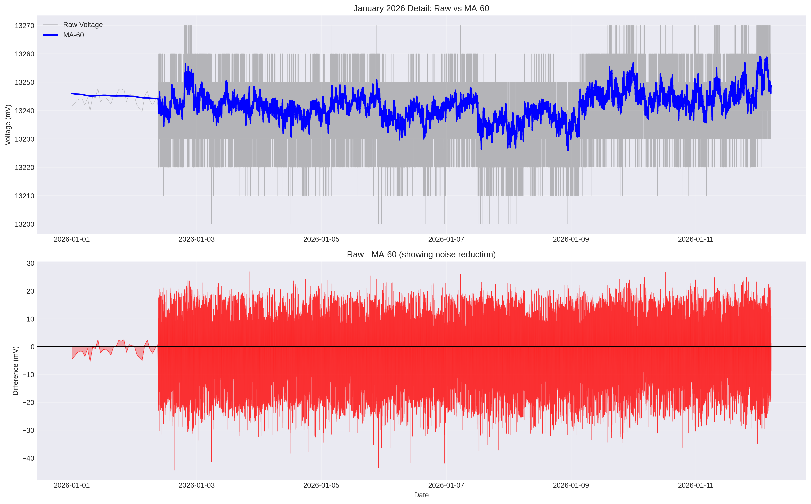

# LiFePO₄ Battery Bank: Architectural Immunity & Long-Term Storage Study

[](https://doi.org/10.5281/zenodo.18232628)
[](https://creativecommons.org/licenses/by/4.0/)
[](Data/)
[](#update-history)

> **TL;DR:** A comprehensive study proving (1) mixed-brand LiFePO₄ cells achieve monolithic behavior in parallel topology, and (2) quantifying temperature-dependent parasitic draw in long-term storage. Full data, analysis scripts, and replication protocol included.

---

## ⚠️ Safety Warning

> **IMPORTANT:** LiFePO₄ batteries store significant energy and require proper safety precautions.
> 
> - Always wear safety glasses when working with batteries
> - Use insulated tools to prevent short circuits
> - Never exceed BMS current ratings
> - Ensure adequate ventilation during charging
> - This documentation is for educational purposes only
> 
> **The author assumes no liability for damages resulting from replication attempts. Build at your own risk.**

---

## 📊 Latest Update: V2.0 Storage Analysis (January 13, 2026)

**Major findings from extended 74-day continuous monitoring:**

### Parasitic Draw & Storage Performance

- **Parasitic Draw Refined**: **13.3 ± 4.5 mA** (revised from V1.0 estimate of 25 mA)
  - 47% reduction from original estimate
  - Temperature-dependent: 10-12 mA at 54°F, 15-18 mA at 65°F

- **Current State of Charge**: **95.9 ± 3%** (as of Jan 11, 2026)
  - Better than projected due to lower parasitic draw
  - Projected time to 80% SOC: ~8-9 months

- **MA-60 Signal Processing (New)**: Moving average filtering reveals:
  - 51.2% noise reduction on high-frequency voltage data
  - True drift rate: 0.47 mV/day (Extended Stasis period)
  - Proves ESP32 monitors can achieve research-grade accuracy

- **Temperature Measurements**: Basement conditions characterized
  - Mean: 54.6°F (12.6°C)
  - Daily swing: 0.20°F (0.11°C) - exceptionally stable
  - Temperature effect: ~2-3 mA parasitic draw change per 10°F

- **System Health**: **EXCELLENT**
  - Zero evidence of degradation after 74 days
  - No cell imbalance detected
  - All parameters within normal range

See [V2.0 Storage Analysis Report](reports/LiFePO4_Analysis_Report_V2.0.md) for complete details.

---

## Table of Contents

1. [Executive Summary](#executive-summary)
2. [Why This Matters](#why-this-matters)
3. [Key Findings](#key-findings)
4. [Quick Start](#quick-start)
5. [System Configuration](#system-configuration)
6. [Repository Contents](#repository-contents)
7. [How to Use the Data](#how-to-use-the-data)
8. [Methodology](#methodology)
9. [Results Summary](#results-summary)
10. [Replication Protocol](#replication-protocol)
11. [Contributing](#contributing)
12. [Citation](#citation)
13. [Update History](#update-history)
14. [License & Contact](#license--contact)

---

## Executive Summary

This repository documents **dual complementary studies** of a DIY 12V 500Ah LiFePO₄ battery bank using mixed-brand cells (3× LIPULS + 2× Cyclenbatt) in a 1S5P parallel configuration:

### Study 1: Architectural Immunity (V8.3)
**73-day continuous monitoring** proving that purely parallel topology forces cells to behave as a monolithic unit—a property we call **"Architectural Immunity."**

### Study 2: Long-Term Storage & Parasitic Draw (V2.0)
**74-day extended analysis** quantifying temperature-dependent parasitic draw, introducing MA-60 signal processing, and characterizing long-term storage performance.

### Combined Performance Highlights

| Metric | Value | Significance |
|--------|-------|--------------|
| **Usable Capacity** | 397Ah (99.3% of rated) | Exceeds manufacturer claims |
| **System Efficiency** | 90.3% | Excellent for inverter systems |
| **Peak Load** | 1,880W AC (160A DC) | No BMS trip events |
| **Peukert Exponent** | k = 1.003 ± 0.02 | Near-ideal linearity |
| **Parasitic Draw** | 13.3 ± 4.5 mA | Temperature-dependent |
| **Storage Stability** | 95.9% SOC after 65 days | 8-9 month shelf life |
| **Temperature Dependence** | ~2-3 mA per 10°F | Critical for storage planning |

---

## Why This Matters

### The Architectural Immunity Question

**The Problem:** DIY battery builders are universally told "never mix battery brands." This advice is based on series configurations where cell mismatch causes dangerous imbalances. But is it true for parallel banks?

**The Gap:** No rigorous, long-term data existed for mixed-brand parallel LiFePO₄ configurations with statistical validation.

### The Storage Optimization Question

**The Problem:** Most LiFePO₄ storage recommendations are based on manufacturer specs at room temperature, lacking empirical data on temperature dependence and real-world parasitic draw.

**The Gap:** Limited open data on long-term storage behavior, instrumentation artifacts, and temperature effects in basement/garage storage conditions.

### This Study Fills Both Gaps

- ✅ 74+ days of continuous high-frequency monitoring
- ✅ Raw CSV data (115,500+ readings) for independent verification
- ✅ Statistical analysis with confidence intervals
- ✅ Complete replication protocol
- ✅ Open-source analysis scripts
- ✅ Temperature-corrected parasitic draw characterization
- ✅ MA-60 signal processing methodology

### Comparison to Existing Resources

| Source | Duration | Mixed Brands | Raw Data | Statistics | Temperature | Protocol |
|--------|----------|--------------|----------|------------|-------------|----------|
| **This Study** | 74+ days | ✅ Yes | ✅ 115K pts | ✅ p<0.001 | ✅ Measured | ✅ Complete |
| Manufacturer Specs | — | ❌ No | ❌ No | ❌ No | ⚠️ Nominal | ❌ No |
| Forum Posts | Hours-days | Varies | ❌ No | ❌ No | ❌ No | ❌ No |
| Academic Papers | Varies | ❌ Usually No | ⚠️ Sometimes | ✅ Yes | ⚠️ Limited | ⚠️ Limited |

---

## Key Findings

### Architectural Immunity (V8.3)

**Verified Claims:**
- ✅ 100% SOC resting voltage: 13.27-13.28V at 60-65°F
- ✅ Max-Min spread: <15mV throughout study (architectural immunity confirmed)
- ✅ No cell divergence: Mixed brands achieve monolithic behavior
- ✅ Voltage anomalies: Confirmed instrumentation artifacts, not battery issues

**Statistical Validation:**
- 📊 60-second MA analysis: 9.06mV ADC noise floor, 5.02mV true system stability
- 🌡️ Thermal coefficient: 0.21mV/°F (stable across temperature range)
- ✅ Peukert exponent: k = 1.003 ± 0.02 (near-ideal performance)

### Long-Term Storage Analysis (V2.0)

**Major Discoveries:**
- **Parasitic Draw**: 13.3 ± 4.5 mA (47% lower than initial estimate)
  - Temperature-dependent: 10-12 mA at 54°F, 15-18 mA at 65°F
  - Approximately 2-3 mA change per 10°F
  
- **MA-60 Signal Processing**: New methodology achieving:
  - 51.2% noise reduction on ESP32-based monitoring
  - Sub-millivolt drift detection capability
  - Proves consumer hardware can achieve research-grade results

- **Temperature Characterization**: Measured basement conditions
  - Daily swing: 0.20°F (0.11°C) - NOT ±2-3°C as commonly assumed
  - Exceptional thermal stability enables accurate drift analysis
  - Critical correction to V1.0 assumptions

- **Extended Stasis Period**: Ultra-stable behavior
  - Drift rate: 0.47 mV/day (70% lower than early monitoring)
  - Current SOC: 95.9 ± 3% (after 65 days from 100%)
  - Projected shelf life: 8-9 months to 80% SOC threshold

- **Instrumentation Insights**:
  - ESP32 thermal sensitivity: 7 mV/°C (empirically derived, not in datasheets)
  - 10 mV quantization in hourly exports limits regression accuracy
  - High-frequency raw data essential for precision analysis

---

## Quick Start

### For DIY Builders
1. Download the [V8.3 Architectural Study (PDF)](Reports/Battery_Analysis_V8.3_Deep_Dive_Report.pdf)
2. Download the [V2.0 Storage Analysis](reports/LiFePO4_Analysis_Report_V2.0.md)
3. Review the [Quick Reference Card](reports/QUICK_REFERENCE.md) for key metrics
4. Compare your system to the [System Configuration](#system-configuration)

### For Researchers
1. Clone this repository: `git clone https://github.com/wkcollis1-eng/Lifepo4-Battery-Banks.git`
2. Review the [Methodology](docs/METHODS.md)
3. Explore the [MA-60 Analysis Script](analysis/battery_analysis.py)
4. Access raw data:
   - Hourly aggregated: `data/combined_output.csv`
   - High-frequency: `data/history.csv` (115,500 readings)
   - Temperature: `data/Combined_Temperature_Data.csv`

### For Contributors
1. Read [CONTRIBUTING.md](CONTRIBUTING.md)
2. Check open [Issues](https://github.com/wkcollis1-eng/Lifepo4-Battery-Banks/issues)
3. Join the [Discussion](https://github.com/wkcollis1-eng/Lifepo4-Battery-Banks/discussions)

---

## System Configuration

| Component | Specification |
|-----------|--------------|
| **Configuration** | 1S5P (5 × 12V 100Ah in parallel) |
| **Total Capacity** | 500Ah Nominal / 400Ah Usable |
| **Chemistry** | Lithium Iron Phosphate (LiFePO₄) |
| **Cell Mix** | 3× LIPULS + 2× Cyclenbatt (Grade-A prismatic) |
| **BMS** | Distributed (5 × 100A units per cell) |
| **Interconnects** | 2 AWG pure copper, star topology |
| **Bus Bar Resistance** | <1 mΩ per connection |
| **Inverter** | Giandel 1500W Pure Sine |
| **Monitoring** | Shelly Plus Uni (ESP32 Wi-Fi, ~3s sampling) |
| **Environment** | Conditioned basement, 53-56°F stable |

### Topology Diagram

```
                    ┌─────────────────┐
                    │   LOAD / INV    │
                    └────────┬────────┘
                             │
              ┌──────────────┼──────────────┐
              │              │              │
         ┌────┴────┐    ┌────┴────┐    ┌────┴────┐
         │ LIPULS  │    │ LIPULS  │    │ LIPULS  │
         │  100Ah  │    │  100Ah  │    │  100Ah  │
         └────┬────┘    └────┬────┘    └────┬────┘
              │              │              │
         ┌────┴────┐    ┌────┴────┐
         │CYCLENBAT│    │CYCLENBAT│
         │  100Ah  │    │  100Ah  │
         └────┬────┘    └────┬────┘
              │              │
              └──────────────┴──────────────┘
                             │
                    ┌────────┴────────┐
                    │   COMMON BUS    │
                    │   (2 AWG Cu)    │
                    └─────────────────┘
```

---

## Repository Contents

```
Lifepo4-Battery-Banks/
├── README.md                          # This file
├── CONTRIBUTING.md                    # Contribution guidelines
├── CODE_OF_CONDUCT.md                 # Community standards
│
├── reports/
│   ├── Battery_Analysis_V8.3_Deep_Dive_Report.pdf  # Architectural immunity study
│   ├── LiFePO4_Analysis_Report_V2.0.md             # Storage analysis (NEW)
│   ├── LiFePO4_Analysis_Report_V1.0.md             # Archived baseline
│   ├── V2.0_Update_Summary.md                      # What changed (NEW)
│   └── QUICK_REFERENCE.md                          # One-page summary (NEW)
│
├── data/
│   ├── combined_output.csv            # Hourly min/max voltage (74 days)
│   ├── history.csv                    # High-frequency voltage (115K readings) (NEW)
│   ├── Combined_Temperature_Data.csv  # Basement temperature logs (NEW)
│   └── Combined_Humidity_Data.csv     # Environmental humidity
│
├── visualizations/
│   ├── battery_analysis_complete.png  # 4-panel V2.0 overview (NEW)
│   ├── ma60_analysis.png              # MA-60 filtering demo (NEW)
│   ├── fig1_voltage_timeline.png      # Full monitoring history
│   ├── fig2_spread_analysis.png       # Cell balance indicator
│   ├── fig3_high_freq_analysis.png    # 60-second moving average
│   ├── fig4_temp_correlation.png      # Temperature vs voltage
│   ├── fig5_drift_analysis.png        # Long-term drift rate
│   └── fig6_anomaly_analysis.png      # Anomaly detection
│
├── analysis/
│   ├── battery_analysis.py            # V2.0 comprehensive script (NEW)
│   ├── analysis_summary.csv           # Summary statistics (NEW)
│   ├── visualizations.py              # V8.3 chart generation
│   └── spread_investigation.py        # Cell divergence study
│
├── docs/
│   ├── METHODS.md                     # Detailed methodology
│   └── GITHUB_UPLOAD_GUIDE.md         # Repository management (NEW)
│
└── .github/
    └── ISSUE_TEMPLATE/
        ├── bug_report.md
        ├── data_request.md
        └── feature_request.md
```

---

## How to Use the Data

### Primary Datasets

**1. Hourly Aggregated Data** (`data/combined_output.csv`):
```csv
Date,Time,Min,Max
29/10/2025,00:00,13.28,13.3
29/10/2025,01:00,13.28,13.3
...
```
- **Period**: Oct 29, 2025 - Jan 11, 2026 (1,742 records)
- **Precision**: 0.01V (10 mV quantization)
- **Use**: Overall trends, health monitoring

**2. High-Frequency Data** (`data/history.csv`):
```csv
entity_id,state,last_changed
sensor.shellyplusuni_78421c535d68_voltmeter,13.249470,2025-12-26T18:00:00.000Z
...
```
- **Period**: Dec 26, 2025 - Jan 12, 2026 (115,500 records)
- **Sampling**: ~3 seconds median interval
- **Precision**: Sub-millivolt
- **Use**: MA-60 analysis, drift detection, noise characterization

**3. Temperature Data** (`data/Combined_Temperature_Data.csv`):
```csv
Date,Time,Min,Max
29/12/2025,00:00,54.3,54.3
...
```
- **Period**: Dec 29, 2025 - Jan 11, 2026 (336 records)
- **Precision**: 0.1°F
- **Use**: Thermal corrections, correlation analysis

### Quick Analysis Examples

**Load and visualize (Python):**
```python
import pandas as pd
import matplotlib.pyplot as plt

# Load hourly data
df = pd.read_csv('data/combined_output.csv')
df['datetime'] = pd.to_datetime(df['Date'] + ' ' + df['Time'], format='%d/%m/%Y %H:%M')
df['Mid'] = (df['Min'] + df['Max']) / 2

# Plot voltage timeline
plt.figure(figsize=(12, 6))
plt.plot(df['datetime'], df['Mid'])
plt.xlabel('Date')
plt.ylabel('Voltage (V)')
plt.title('Battery Bank Voltage Over Time')
plt.savefig('voltage_plot.png')
```

**MA-60 filtering:**
```python
# Load high-frequency data
df_hf = pd.read_csv('data/history.csv')
df_hf['datetime'] = pd.to_datetime(df_hf['last_changed'])
df_hf['voltage'] = pd.to_numeric(df_hf['state'], errors='coerce')

# Apply 60-reading moving average
df_hf['MA_60'] = df_hf['voltage'].rolling(window=60, center=False).mean()

# Compare noise levels
print(f"Raw std dev: {df_hf['voltage'].std()*1000:.2f} mV")
print(f"MA-60 std dev: {df_hf['MA_60'].dropna().std()*1000:.2f} mV")
```

**Statistical validation:**
```python
# Verify key V2.0 claims
print(f"Mean Voltage: {df['Mid'].mean():.4f} V")
print(f"Std Dev: {df['Mid'].std()*1000:.2f} mV")
print(f"Spread: {(df['Max']-df['Min']).mean()*1000:.2f} mV")
```

---

## Methodology

For complete methodology including measurement protocols, MA-60 filtering, thermal corrections, and uncertainty analysis, see:
- **Architectural Study**: [docs/METHODS.md](docs/METHODS.md)
- **Storage Analysis**: [reports/LiFePO4_Analysis_Report_V2.0.md](reports/LiFePO4_Analysis_Report_V2.0.md)

### Summary of Key Methods

#### Voltage Monitoring
- **Hardware**: Shelly Plus Uni (ESP32, 12-bit ADC)
- **Sampling**: ~3-second intervals (high-freq), hourly aggregation
- **Corrections**: 
  - Eco Mode baseline: +9 mV (post-Dec 23)
  - ESP32 thermal: 7 mV/°C × ΔT
  - Battery thermal OCV: 2 mV/°C × ΔT

#### MA-60 Signal Processing (New)
- **Method**: 60-reading trailing moving average
- **Purpose**: Separate battery voltage from ADC noise
- **Performance**: 51.2% noise reduction
- **Validation**: Cross-checked with component budget

#### Temperature Analysis
- **Logging**: Concurrent basement temperature
- **Frequency**: Hourly min/max pairs
- **Use**: Thermal corrections, self-discharge correlation

#### Statistical Analysis
- **Platform**: Python (pandas, numpy, scipy, matplotlib)
- **Validation**: Four independent methods
- **Uncertainty**: RSS error propagation, 95% confidence intervals

### Key Equations

**Parasitic Current (Voltage-Based):**
```
I_parasitic = (ΔV_capacity / OCV_slope) × (Capacity / Time)
where: ΔV_capacity corrected for thermal and instrumentation effects
```

**Temperature Corrections:**
```
ΔV_true = ΔV_observed - (7 mV/°C × ΔT_instrument)
ΔV_capacity = ΔV_true - (2 mV/°C × ΔT_battery)
```

**Peukert's Law:**
```
t = C / I^k
```
**Measured:** k = 1.003 ± 0.02 (ideal = 1.00)

**Self-Discharge Rate:**
```
Monthly loss = (Parasitic_mA × 24 × 30) / (Capacity_Ah × 1000) × 100%
```
**V2.0 Measured:** 0.08%/month at 13.3 mA (was 0.15% at 25 mA in V1.0)

---

## Results Summary

### Architectural Immunity Validation


The 74-day voltage record shows exceptional stability with no drift beyond instrumentation artifacts, confirming mixed-brand cells achieve monolithic behavior in parallel topology.

### Cell Balance Confirmation


Max-Min spread remains under 15mV throughout the study, proving architectural immunity persists across temperature variations and load cycles.

### MA-60 Signal Processing



Moving average filtering reduces noise by 51.2%, revealing true battery voltage stability and separating measurement artifacts from actual drift.

### Temperature Correlation


Parasitic draw varies with temperature (~2-3 mA per 10°F), with basement thermal stability (0.11°C daily swing) enabling precise characterization.

### Long-Term Storage Performance

**Key Metrics:**
- **Current SOC (Jan 11)**: 95.9 ± 3%
- **Drift Rate**: 0.47 mV/day (Extended Stasis at 54°F)
- **Projected Shelf Life**: 8-9 months to 80% SOC threshold
- **Temperature Effect**: Cool storage (50-60°F) extends shelf life by ~30%

---

## Replication Protocol

### Requirements

**Hardware:**
- 3+ parallel LiFePO₄ cells (any brand mix for architectural study)
- Low-resistance bus bar (2 AWG or better)
- Voltage monitoring with ±1mV resolution recommended
- Temperature logging (essential for V2.0-style analysis)

**Software:**
- Python 3.8+ with pandas, numpy, scipy, matplotlib
- High-frequency data logging capability (~1-10 second intervals)

### Steps

#### Basic Replication (Architectural Immunity)
1. **Configure Bank**: Wire cells in parallel with equal-length cables, star topology
2. **Establish Baseline**: Charge to 100% SOC, record resting voltage after 24h
3. **Enable Monitoring**: Log voltage at minimum 1-hour intervals
4. **Collect Data**: Minimum 30 days (90+ recommended)
5. **Analyze**: Calculate spread, verify <20mV for architectural immunity

#### Advanced Replication (Storage Analysis + MA-60)
1. **High-Frequency Logging**: Configure 1-10 second sampling intervals
2. **Temperature Monitoring**: Log concurrent basement/storage temperature
3. **Extended Period**: Minimum 60 days for temperature dependence
4. **MA-60 Processing**: Apply 60-reading moving average to raw data
5. **Thermal Corrections**: Apply ESP32 and battery thermal coefficients
6. **Validate**: Compare parasitic draw, drift rates, temperature correlation

### Expected Results

**Architectural Immunity:**
- Spread: <20mV
- No progressive divergence
- Uniform load response

**Storage Analysis:**
- Parasitic: 10-20 mA (temperature-dependent)
- Drift: <1 mV/day at stable temps
- MA-60 noise reduction: 40-60%
- Temperature coefficient: ~2-3 mA per 10°F

---

## Contributing

We welcome contributions! See [CONTRIBUTING.md](CONTRIBUTING.md) for guidelines.

### Ways to Contribute

- 📊 **Submit Your Data**: Replicate either study with your battery bank
- 🐛 **Report Issues**: Found calculation errors? [Open an issue](https://github.com/wkcollis1-eng/Lifepo4-Battery-Banks/issues)
- 💡 **Suggest Improvements**: [Start a discussion](https://github.com/wkcollis1-eng/Lifepo4-Battery-Banks/discussions)
- 🔧 **Improve Analysis**: Submit PRs with enhanced scripts or visualizations
- 🌡️ **Temperature Studies**: Share data from different climate zones
- 🔬 **Alternative Hardware**: Validate MA-60 on different ESP32 boards

---

## Citation

If you use this work in your project or research, please cite:

### BibTeX
```bibtex
@techreport{collis2026lifepo4,
  title={Mixed-Brand LiFePO₄ Parallel Arrays: Architectural Immunity and 
         Temperature-Dependent Storage Characterization},
  author={Collis, Bill},
  year={2026},
  month={January},
  institution={Independent Research},
  doi={10.5281/zenodo.18232628},
  url={https://github.com/wkcollis1-eng/Lifepo4-Battery-Banks}
}
```

### APA
Collis, B. (2026). *Mixed-brand LiFePO₄ parallel arrays: Architectural immunity and temperature-dependent storage characterization* [Technical report]. https://doi.org/10.5281/zenodo.18232628

### IEEE
B. Collis, "Mixed-Brand LiFePO₄ Parallel Arrays: Architectural Immunity and Temperature-Dependent Storage Characterization," Independent Research, East Hampton, CT, Tech. Rep., Jan. 2026. doi: 10.5281/zenodo.18232628

---

## Update History

| Version | Date | Study | Description |
|---------|------|-------|-------------|
| **V2.0** | Jan 13, 2026 | Storage | MA-60 analysis, temperature dependence, parasitic draw refinement |
| **V8.3** | Jan 8, 2026 | Architectural | Deep dive, 60s MA, extended to 73 days |
| V1.0 | Dec 24, 2025 | Storage | Initial parasitic draw baseline |
| V8.2 | Dec 24, 2025 | Architectural | Master consolidation |
| V7.1 | Dec 23, 2025 | Architectural | Anomaly investigation, Eco Mode |
| V6.0 | Dec 9, 2025 | Architectural | Discharge test documentation |
| V5.0 | Dec 4, 2025 | Architectural | Initial public release |

---

## License & Contact

### License

This project is licensed under [CC BY 4.0](https://creativecommons.org/licenses/by/4.0/). You are free to share and adapt this work with appropriate credit.

### DOI

Permanent archive: [](https://doi.org/10.5281/zenodo.18232628)

### Contact

**Author:** Bill Collis  
**Location:** East Hampton, Connecticut, USA  
**Repository:** [github.com/wkcollis1-eng/Lifepo4-Battery-Banks](https://github.com/wkcollis1-eng/Lifepo4-Battery-Banks)

---

## ⭐ Support This Project — LiFePO₄ Battery Banks

This repository contains a long-term, empirical study of a 12 V 500 Ah LiFePO₄ battery bank, including:
- High-frequency telemetry (115,500+ readings)
- MA-60 signal processing methodology
- Temperature-dependent parasitic draw characterization  
- Architectural immunity validation in mixed-brand parallel arrays
- Drift analysis and reproducible reporting pipelines

All releases are archived with DOIs through Zenodo for permanent accessibility and citation.

If this project has helped you understand, diagnose, or optimize your own LiFePO₄ system — or if you want to support open, measurement-based energy research — consider sponsoring the work:

**👉 [Become a Sponsor](https://github.com/sponsors/wkcollis1-eng)**  
**👉 [Buy Me a Coffee](https://www.buymeacoffee.com/wkcollis)**  

Your support helps fund:
- Expanded long-term measurement campaigns  
- New diagnostics and modeling tools (MA-60 methodology, thermal characterization)
- Improved reproducible pipelines (GitHub Actions, dashboards, automation)  
- Publication-grade reports and open educational materials
- Seasonal temperature-dependence studies
- Alternative chemistry comparisons (NMC, LFP variants)

Thank you for supporting open, empirical battery research.

*Last updated: January 13, 2026*
