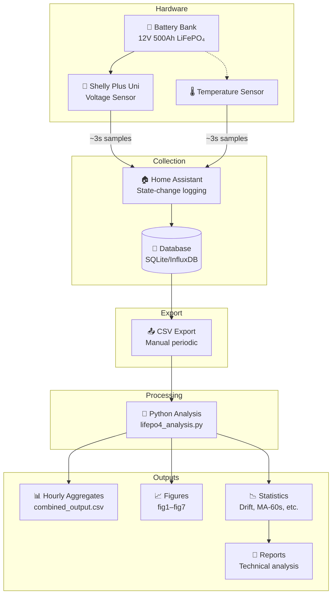

# 📐 Methodology

This document describes the analytical methods, estimators, and definitions used in this study.

---

## Contents

1. [Data Pipeline](#1-data-pipeline)
2. [Definitions](#2-definitions)
3. [Drift Estimation](#3-drift-estimation)
4. [MA-60s Noise Reduction](#4-ma-60s-noise-reduction)
5. [Temperature-Voltage Regression](#5-temperature-voltage-regression)
6. [Architectural Immunity Assessment](#6-architectural-immunity-assessment)
7. [References](#7-references)

---

## 1. Data Pipeline

The following diagram shows the data flow from sensor to analysis outputs:



### 1.1 Sampling Characteristics

| Data Type | Method | Cadence | Notes |
|:----------|:-------|:--------|:------|
| High-frequency voltage | State-change logging | ~3s median | Gaps when stable |
| Hourly voltage | Aggregated min/max | 1 hour | Continuous |
| Temperature | State-change logging | ~3s median | Started Dec 29, 2025 |

### 1.2 Known Regime Changes

| Date | Time (Local) | Event | Impact |
|:-----|:-------------|:------|:-------|
| Dec 23, 2025 | ~15:40 | Eco Mode enabled | Spread measurement change |
| Dec 29, 2025 | — | Temperature sensor added | Enables temp correlation |

---

## 2. Definitions

### 2.1 MA-60s (Moving Average, 60 Seconds)

A trailing, **time-based** 60-second rolling mean applied to high-frequency voltage data:

```python
df['MA60'] = df['voltage'].rolling('60s', min_periods=1).mean()
```

> [!IMPORTANT]
> This is a **time-window** average, not a fixed-sample-count average. It adapts to variable sampling cadence, ensuring consistent smoothing regardless of data density.

### 2.2 Mid-Voltage

The arithmetic mean of hourly minimum and maximum voltage:

```
Mid = (Min + Max) / 2
```

### 2.3 Spread

The difference between hourly maximum and minimum voltage:

```
Spread = Max - Min
```

> [!NOTE]
> This is a **single-channel bus measurement**. It reflects measurement noise and ADC behavior, **not** per-cell or per-block voltage divergence. To claim cell-level divergence, per-unit sensing would be required.

### 2.4 Effective Draw vs. System Draw

| Term | Definition |
|:-----|:-----------|
| **Effective draw** | Parasitic current inferred from voltage drift during stasis (constant-load model) |
| **System draw** | Actual instantaneous current, which varies with telemetry bursts (Wi-Fi, polling cycles) |

The effective draw (~13–20 mA) is lower than peak system draw because it averages over duty cycles.

---

## 3. Drift Estimation

### 3.1 Method: OLS on Daily Mean Mid-Voltage

1. Compute daily mean of hourly mid-voltage
2. Fit Ordinary Least Squares (OLS) regression: `V = a + b·t`
3. Report slope `b` in mV/day

```python
from scipy import stats

# Compute daily means
daily_mid = hourly_df.groupby('date')['Mid'].mean()

# Days from start
days = (daily_mid.index - daily_mid.index[0]).days

# OLS regression
slope, intercept, r, p, se = stats.linregress(days, daily_mid)
drift_mv_per_day = slope * 1000  # Convert V to mV
```

### 3.2 Window Dependence

> [!WARNING]
> Drift rates are **window- and estimator-dependent** on a non-linear relaxation curve. The voltage decay follows an exponential-like approach to equilibrium, not a linear decline.

| Window | Period | Drift Rate | R² | Interpretation |
|:-------|:-------|:-----------|:---|:---------------|
| Full stasis | Nov 22 → Jan 31 | −0.665 mV/day | 0.876 | Long-term average |
| Last 30 days | Jan 2 → Jan 31 | −0.165 mV/day | 0.132 | Near-equilibrium |

The **75% rate reduction** indicates the system is approaching a stable storage state.

### 3.3 Why Multiple Slopes?

Depending on:
- Window start/end dates
- Whether you use daily means, MA-60s means, or raw samples
- OLS vs. robust regression

...you may compute drift rates anywhere from ~0.16 to ~0.30 mV/day for late January.

**This is not a contradiction**—it's expected behavior for a flattening curve.

> [!TIP]
> **Best practice:** Always state the window and estimator explicitly when reporting drift rates.

---

## 4. MA-60s Noise Reduction

### 4.1 Method

1. Apply time-based 60-second rolling mean to high-frequency voltage
2. Compute standard deviation of raw and smoothed series
3. Report reduction: `(1 - σ_MA60 / σ_raw) × 100%`

```python
# Apply MA-60s (time-based)
hf_df['MA60'] = hf_df['voltage'].rolling('60s', min_periods=1).mean()

# Compute noise reduction
raw_std = hf_df['voltage'].std() * 1000      # mV
ma60_std = hf_df['MA60'].std() * 1000        # mV
reduction = (1 - ma60_std / raw_std) * 100   # %
```

### 4.2 Results

| Scope | Raw σ | MA-60s σ | Reduction |
|:------|:------|:---------|:----------|
| Global (328k samples) | 10.38 mV | 5.98 mV | 42.5% |
| Segment range | — | — | 42–50% |

### 4.3 Why Report a Band (42–50%)?

Noise reduction varies with:
- **Sampling regularity** — Gaps reduce smoothing effectiveness
- **Interference environment** — EMI varies over time
- **Time of day** — Different noise profiles

Reporting as a band (42–50%) rather than a single number provides a more honest representation.

---

## 5. Temperature-Voltage Regression

### 5.1 Two-Factor Model

To isolate temperature effects from monotonic drift:

```
V = a + b₁·t + b₂·T + ε
```

Where:
- `t` = days from start (controls for drift)
- `T` = temperature (°F)
- `b₁` = residual drift rate after temperature control
- `b₂` = temperature coefficient

```python
import statsmodels.api as sm

# Prepare features
X = merged_df[['days', 'temperature']]
X = sm.add_constant(X)
y = merged_df['mid_voltage']

# Fit model
model = sm.OLS(y, X).fit()
temp_coef = model.params['temperature'] * 1000  # mV/°F
```

### 5.2 Results

| Coefficient | Value | SE | Interpretation |
|:------------|:------|:---|:---------------|
| b₂ (temperature) | +1.01 mV/°F | 0.27 | System-level sensitivity |
| b₁ (residual drift) | −0.115 mV/day | 0.026 | After temperature control |

### 5.3 Interpretation Caveats

> [!NOTE]
> This coefficient is **system-level**, not pure LiFePO₄ OCV temperature behavior.

It includes:
- Pack electrochemistry
- ADC reference drift
- Wiring/contact resistance changes
- Enclosure thermal gradients

The temperature effect is **second-order** relative to monotonic drift for endurance inference, but matters for:
- Seasonal extrapolation
- Residual fitting quality
- Comparing measurements across different ambient conditions

---

## 6. Architectural Immunity Assessment

### 6.1 What We Can Claim

From bus-level voltage monitoring, we observe:

✅ No growing instability signatures  
✅ Trendless anomalies (no systematic pattern)  
✅ Stable detrended variance over 94+ days  
✅ Spread increase correlates with measurement regime, not electrochemistry  

### 6.2 What We Cannot Claim (Without Additional Sensing)

❌ Per-cell SOC equality  
❌ Per-block current sharing  
❌ Individual cell degradation rates  

### 6.3 Evidence Quality

The "architectural immunity" hypothesis is **supported but not proven** by this data.

| Evidence Type | Available | Status |
|:--------------|:----------|:-------|
| Bus voltage stability | Yes | ✅ Supports hypothesis |
| No divergence trend | Yes | ✅ Supports hypothesis |
| Per-cell voltage | No | ❓ Would strengthen claim |
| Per-block current | No | ❓ Would strengthen claim |

**Definitive confirmation** would require per-unit voltage or current sensing.

---

## 7. References

1. Wang, Y., et al. (2023). "State of Charge Estimation of LiFePO₄ in Various Temperature Scenarios." *Batteries*, 9(1), 43.  
   DOI: [10.3390/batteries9010043](https://doi.org/10.3390/batteries9010043)

2. Espressif Developer Portal (2025). "Comparing ADC Performance of Espressif SoCs."  
   Link: [developer.espressif.com](https://developer.espressif.com/blog/2025/08/adc-performance/)

3. ESP-IDF Programming Guide. "ESP32-S2 ADC Calibration."  
   Link: [docs.espressif.com](https://docs.espressif.com/projects/esp-idf/en/v4.4.8/esp32s2/api-reference/peripherals/adc.html)

4. NIST/SEMATECH e-Handbook of Statistical Methods. "OLS Regression."  
   Link: [itl.nist.gov](https://www.itl.nist.gov/div898/handbook/)

---

## See Also

- [Glossary](glossary.md) — Terms and definitions
- [Evidence Map](evidence_map.md) — Claim-to-data traceability
- [Data Dictionary](../data/README.md) — Dataset documentation
