# 📈 Figures Gallery

Visualization outputs from the analysis pipeline.

---

## Contents

- [INA228-Era Figures](#ina228-era-figures)
- [Hero Figures](#hero-figures)
- [Complete Figure Index](#complete-figure-index)
- [Figure Descriptions](#figure-descriptions)
- [Regenerating Figures](#regenerating-figures)
- [Style Guide](#style-guide)

---

## INA228-Era Figures

Produced by `python scripts/ina228_analysis.py` from the CSVs in `data/`. These
accompany the [2026-08-26 report](../reports/LiFePO4_Report_2026-08-26.md).

---

### ⚡ Directly Measured Quiescent Drain

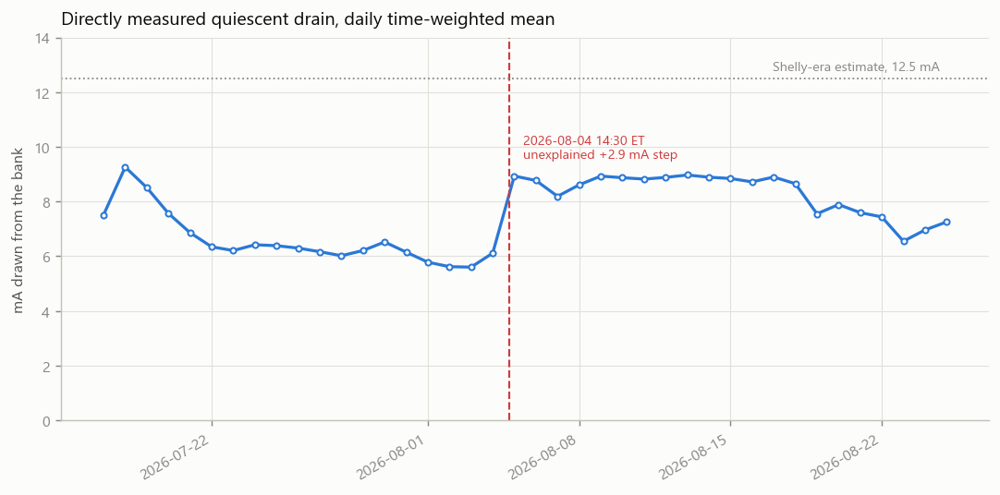

**What it shows:** Daily time-weighted mean current with no charger and no
deliberate load, over 41 days.

**Key insight:** **7.4 ± 2.4 mA** — measured, not inferred, and it is the monitor
itself: with the Shelly and DROK meter retired and the inverter off, nothing else
is on the bus. The dotted line is the old 12.5 mA bench estimate. The dashed
vertical marks the 2026-08-04 rewire, whose +2.9 mA step is an instrument offset
shift (1.08 µV at this shunt), not a load change.

---

### 📊 The Same Charge, Measured Three Ways

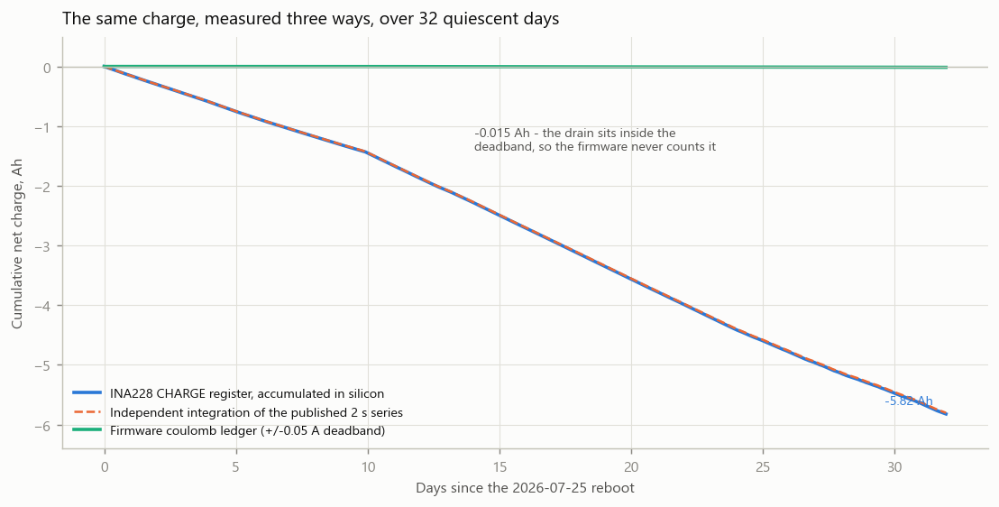

**What it shows:** Cumulative net charge over 31.96 continuous days from three
independent accountants — the INA228's own silicon CHARGE register, an
independent re-integration of the published 2 s series, and the firmware's
coulomb ledger.

**Key insight:** Two lines descend together (0.35% apart); one stays flat at zero.
The firmware's ±0.05 A deadband is 6.7× larger than the 7.5 mA drain, so the
ledger books 0.26% of the charge that moved. **This is the figure to look at
before trusting any coulomb-counted SOC after a long storage period.**

---

### 📉 Post-Charge Relaxation

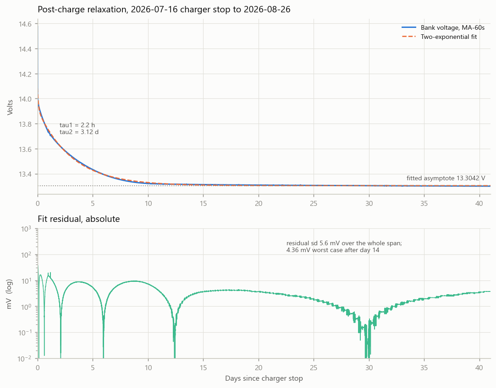

**What it shows:** 41 days of relaxation from the charger-stop edge, with a
two-exponential fit and its residual on a log scale.

**Key insight:** tau1 = 2.16 h (surface charge), tau2 = 3.12 d (bulk diffusion);
99% complete at ~14 days. The residual's regrowth after day 28 is the slow linear
decline the model does not contain — that is the real coulombic loss, not a
defect in the fit.

---

### 🔍 The Noise Floor

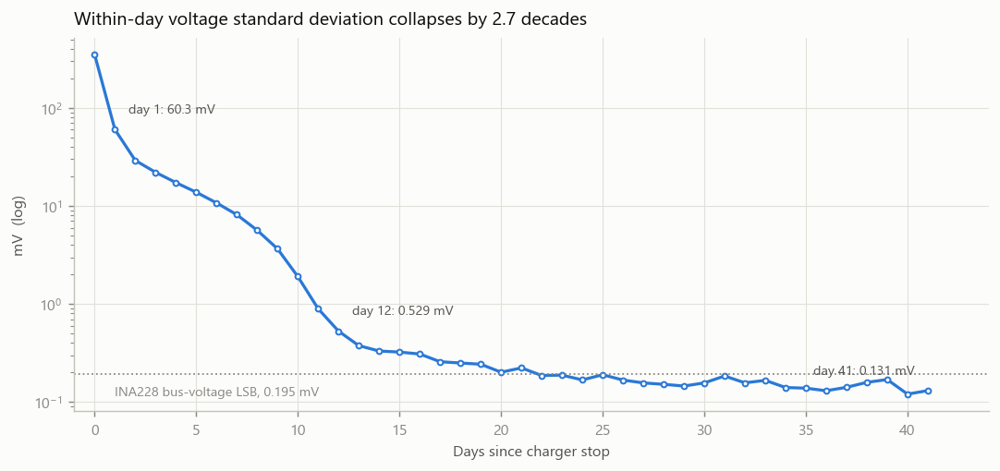

**What it shows:** Within-day voltage standard deviation, log scale, day 0 to 41.

**Key insight:** 60.25 mV → **0.131 mV**, a fall of 2.7 decades, ending *below*
the INA228's own 195.3 µV bus LSB — which is expected for a dithered quantised
signal. This is why the old stasis thresholds no longer discriminate.

---

### 🔌 LiTime 80 A Charge Profile

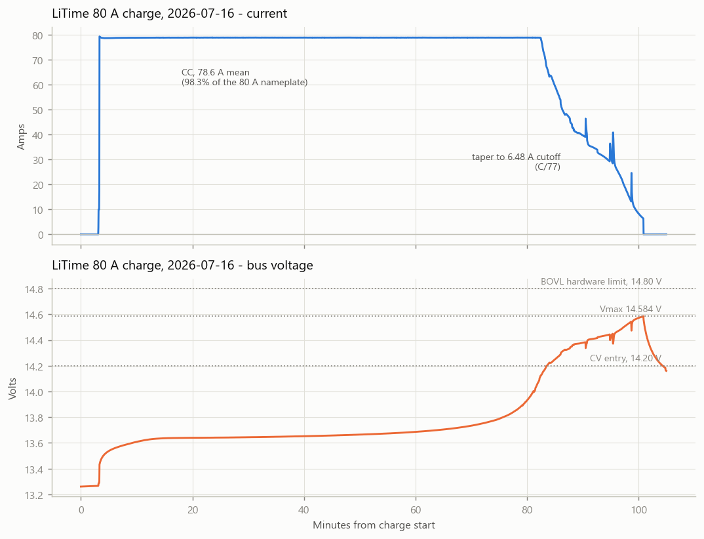

**What it shows:** Current and bus voltage through a full CC/CV charge, at 2 s
resolution, on separate panels sharing a time axis.

**Key insight:** CC at 78.6 A (98.3% of nameplate), CV entry at 14.20 V, peak
14.5842 V, taper to a 6.48 A cutoff. The oscillation above 14.4 V in both panels
is BMS balancing — 183 mV pk-pk, 8 reversals over 10.7 minutes.

---

### 🔋 Discharge Campaign

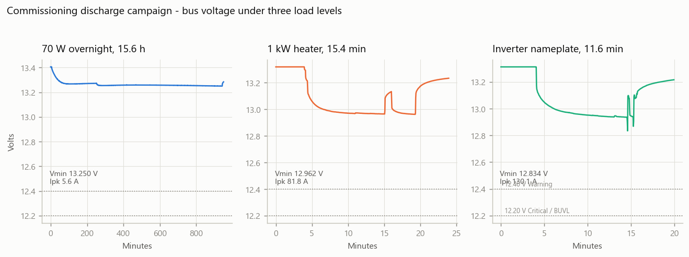

**What it shows:** Bus voltage under three load levels — 70 W overnight, ~1 kW
heater, and inverter nameplate — on a shared y-scale.

**Key insight:** Even at 130 A (0.26 C) the trace stays 434 mV clear of the
12.40 V warning threshold. Sag is 1.2% / 2.7% / 3.6% across the three legs.

---

### 🕓 Ten Months Across an Instrument Change

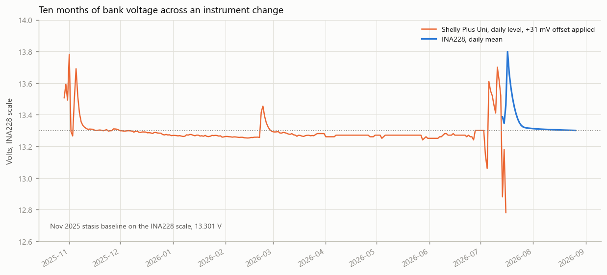

**What it shows:** The full published record on one voltage scale, with the
Shelly trace offset-corrected onto the INA228 scale.

**Key insight:** The bank sat 30–40 mV below its November 2025 baseline all
winter, and the July 2026 recharge returned it to that baseline — 13.3005 V
measured against 13.301 V restated.

---

### 📏 Shelly vs INA228 Offset

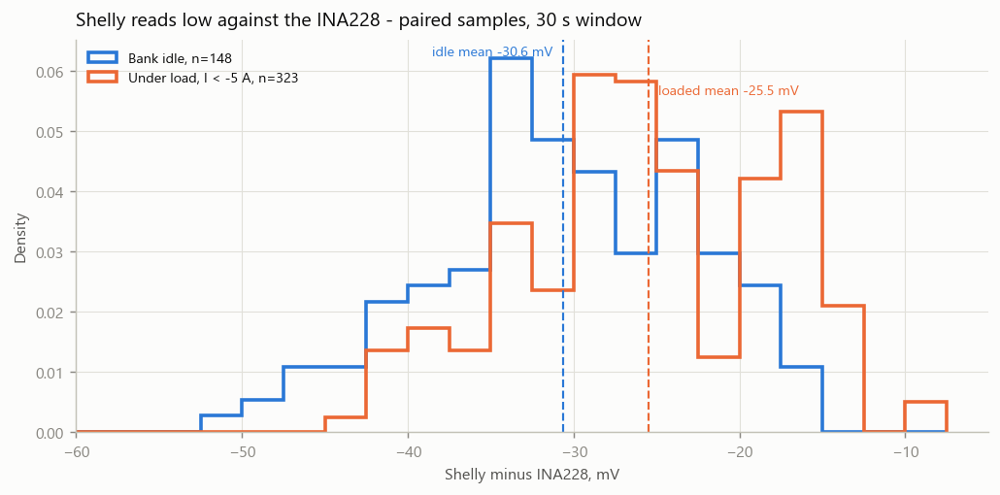

**What it shows:** Distribution of (Shelly − INA228) over their 817-sample
overlap, split by whether the bank was idle or loaded.

**Key insight:** The Shelly reads **30.6 mV low** on a quiet bank (n = 148 gated
pairs). This is the number that makes ten months of two-instrument data
comparable — and the ~5 mV gap between the idle and loaded subsets is why the
usable uncertainty is ±3 mV rather than the CI's ±1.3 mV.

---

## Hero Figures

The three most important visualizations for understanding this study:

### 📊 Figure 1: Voltage Timeline

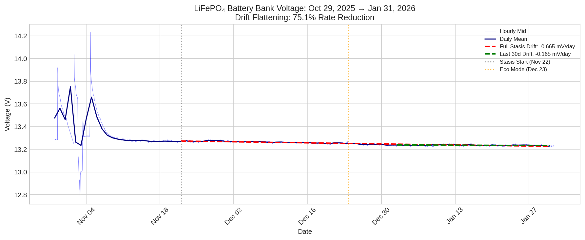

**What it shows:** Complete 125+ day voltage monitoring record from Oct 2025 through Mar 2026, with OLS drift regression overlay.

**Key insight:** Monotonic decline approaching equilibrium; no divergence signatures.

---

### 📉 Figure 2: MA-60s Noise Reduction

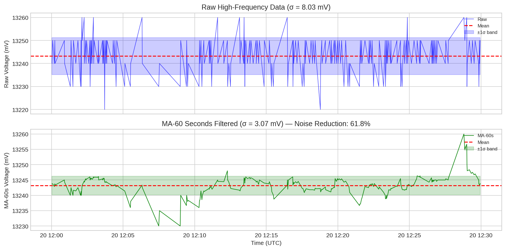

**What it shows:** Before/after comparison of raw voltage vs. 60-second time-based rolling mean.

**Key insight:** 42–50% apparent noise reduction while preserving trend information.

---

### 📈 Figure 5: Drift Flattening

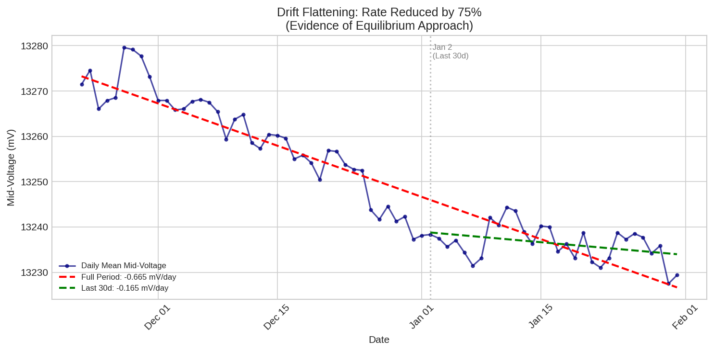

**What it shows:** Comparison of drift rates between full stasis period and last 30 days.

**Key insight:** 75% rate reduction indicates approach to equilibrium storage state.

---

## Complete Figure Index

| Figure | File | Description | Report Section |
|:-------|:-----|:------------|:---------------|
| 1 | `fig1_voltage_timeline.png` | Full voltage timeline with drift overlay | §3 |
| 2 | `fig2_ma60_comparison.png` | Raw vs MA-60s filtered comparison | §5 |
| 3 | `fig3_spread_analysis.png` | Hourly spread showing Eco Mode effect | §4 |
| 4 | `fig4_temperature_voltage.png` | Temperature-voltage regression | §6 |
| 5 | `fig5_drift_flattening.png` | Full-period vs last-30d drift comparison | §3 |
| 6 | `fig6_ma60_segments.png` | MA-60s performance by time segment | §5 |
| 7 | `fig7_soc_projection.png` | SOC projection under parasitic draw model | §7 |

---

## Figure Descriptions

### Figure 3: Spread Analysis

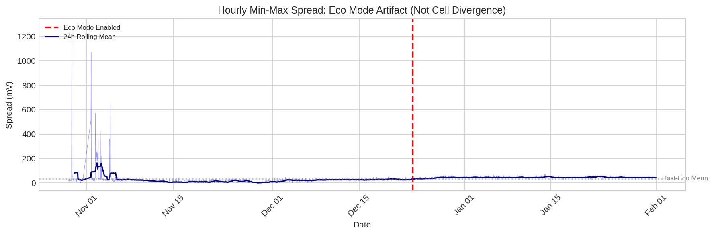

**What it shows:** Hourly voltage spread (Max − Min) over the monitoring period, with the Eco Mode transition marked.

**Key insight:** Spread increase on Dec 23 correlates with firmware change, not electrochemical divergence.

---

### Figure 4: Temperature-Voltage Relationship

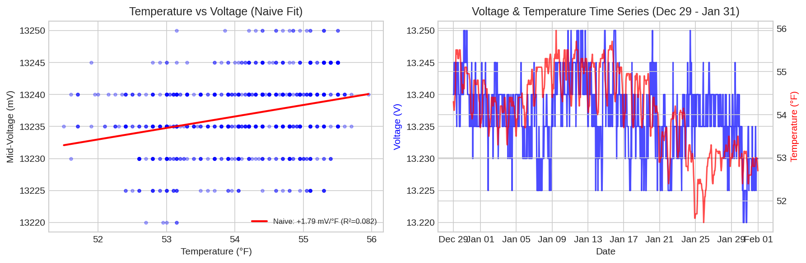

**What it shows:** Two-factor regression isolating temperature effects from monotonic drift.

**Key insight:** System-level coefficient of +1.0 ± 0.3 mV/°F (includes measurement chain effects).

---

### Figure 6: MA-60s Segments

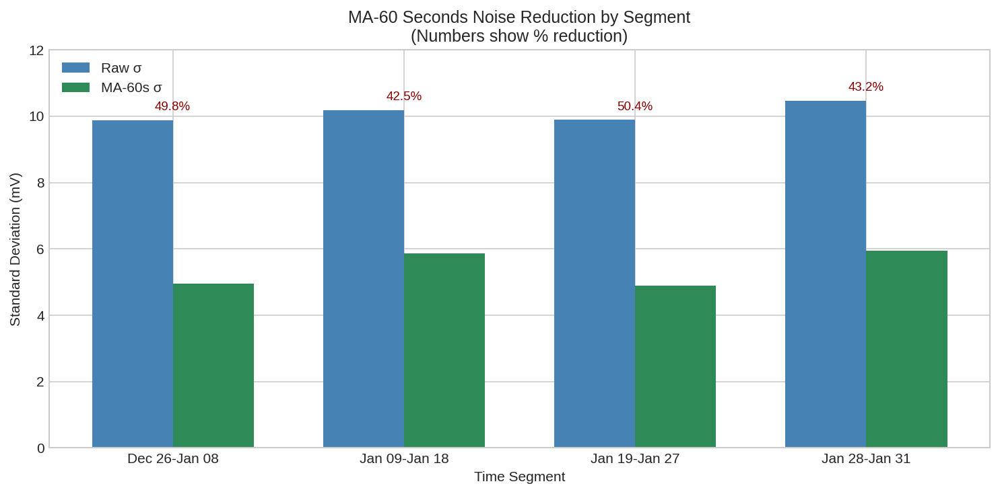

**What it shows:** Noise reduction performance across different time segments of the high-frequency data.

**Key insight:** Performance varies 42–50% depending on sampling regularity and interference.

---

### Figure 7: SOC Projection

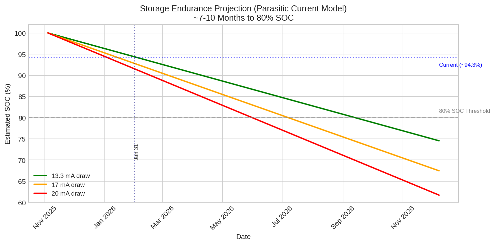

**What it shows:** Projected State of Charge decline under different parasitic draw assumptions.

**Key insight:** 7–10 months to 80% SOC at ~13–20 mA effective draw.

> [!WARNING]
> **Superseded 2026-08-26.** The draw is now measured at 7.4 ± 2.4 mA and endurance to 80% SOC is **≈15 months** on the validated 397 Ah. This figure also used the 500 Ah nameplate rather than the validated capacity. See `fig_ina228_parasitic.png` and [report §7](../reports/LiFePO4_Report_2026-08-26.md).

---

## Regenerating Figures

### Standard Resolution (Web)

```bash
# From repository root
python scripts/lifepo4_analysis.py
```

Figures are generated at **150 DPI** for web display.

### High Resolution (Print/Publication)

For print or publication quality, modify the script or use:

```python
import matplotlib.pyplot as plt

# Set higher DPI before saving
plt.savefig('figures/fig1_voltage_timeline.png', dpi=300, bbox_inches='tight')
```

### Dependencies

Ensure all requirements are installed:

```bash
pip install -r requirements.txt
```

Required packages for figure generation:
- `matplotlib` — Core plotting
- `seaborn` — Statistical visualizations
- `pandas` — Data manipulation
- `numpy` — Numerical operations

---

## Style Guide

### Current Style

| Property | Value |
|:---------|:------|
| Resolution | 150 DPI (web) |
| Format | PNG |
| Color palette | Matplotlib defaults |
| Font | System default |

### Recommended Improvements

For publication-ready figures, consider:

```python
import matplotlib.pyplot as plt
import seaborn as sns

# Set style
plt.style.use('seaborn-v0_8-whitegrid')
sns.set_palette('colorblind')

# Figure size for publication (single column: 3.5", double: 7")
fig, ax = plt.subplots(figsize=(7, 4))

# Font sizes
plt.rcParams.update({
    'font.size': 10,
    'axes.titlesize': 12,
    'axes.labelsize': 10,
    'xtick.labelsize': 9,
    'ytick.labelsize': 9,
    'legend.fontsize': 9,
})

# Save at publication DPI
plt.savefig('figure.png', dpi=300, bbox_inches='tight')
plt.savefig('figure.pdf', bbox_inches='tight')  # Vector format
```

### Color Accessibility

Current figures use default colors. For improved accessibility:

```python
# Colorblind-friendly palette
colors = ['#0077BB', '#EE7733', '#009988', '#CC3311', '#33BBEE']

# Or use seaborn's colorblind palette
sns.set_palette('colorblind')
```

---

## File Sizes

| Figure | Size | Dimensions |
|:-------|-----:|:-----------|
| fig1_voltage_timeline.png | 114 KB | 1200 × 600 |
| fig2_ma60_comparison.png | 215 KB | 1200 × 800 |
| fig3_spread_analysis.png | 85 KB | 1200 × 600 |
| fig4_temperature_voltage.png | 174 KB | 1200 × 800 |
| fig5_drift_flattening.png | 127 KB | 1200 × 600 |
| fig6_ma60_segments.png | 57 KB | 1200 × 400 |
| fig7_soc_projection.png | 132 KB | 1200 × 600 |

---

## See Also

- [Evidence Map](../docs/evidence_map.md) — Links figures to claims
- [Technical Report](../reports/LiFePO4_Report_2026-08-26.md) — Current figures in context
- [Previous Report](../reports/LiFePO4_Report_2026-03-31.md) — Shelly-era figures in context
- [Methodology](../docs/methodology.md) — How data was analyzed
