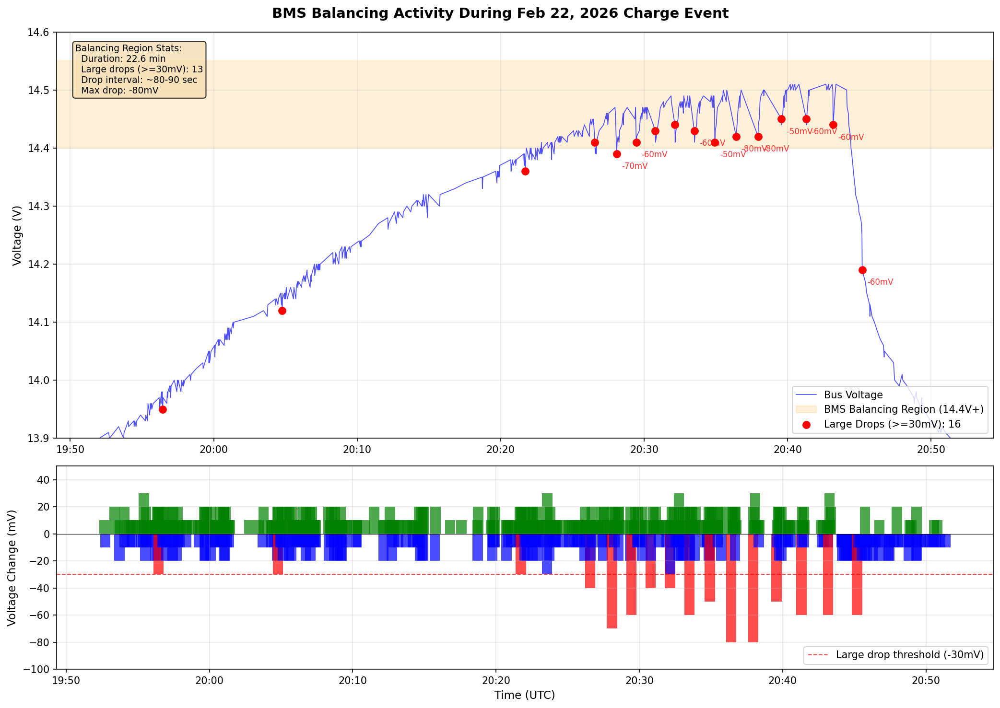
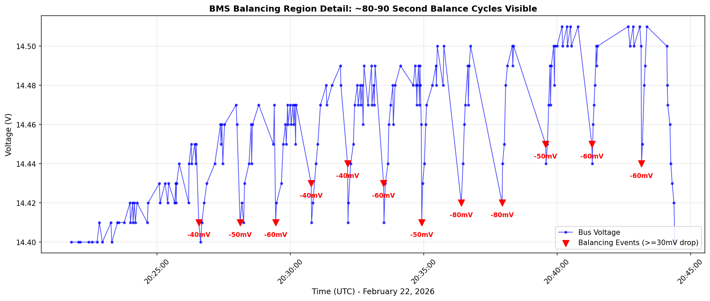

# LiFePO₄ Battery Bank: Technical Report

**Data through:** March 1, 2026
**Published:** March 1, 2026
**Version:** 2026-03-01
**DOI:** [10.5281/zenodo.14538065](https://doi.org/10.5281/zenodo.14538065)

---

## Abstract

This report presents findings from a 125+ day monitoring study of a DIY 12V 500Ah LiFePO₄ battery bank configured with mixed-brand cells in parallel, including analysis of a charge event on February 22, 2026. The study extends the previous "architectural immunity" analysis and provides new insights into parasitic losses and self-discharge behavior.

**Key results:** The battery bank delivered 397 Ah usable capacity (99.3% of rated) in initial discharge testing. Extended stasis monitoring (92 days, Nov 22 - Feb 21) revealed a drift rate of -0.575 mV/day with 21% flattening in the final 30 days. A charge event on Feb 22 added approximately 81 Ah (1.289 kWh AC input). Post-charge relaxation showed typical surface-charge dissipation with voltage settling from 13.53V to 13.27V over 8 days. **Crucially, the measured parasitic drain of 12.5 mA is lower than the expected 18-27 mA from known loads, implying effectively zero battery self-discharge and that the Shelly Plus Uni in Eco Mode draws significantly less than its specification.**

**Implications:** These findings confirm excellent LiFePO₄ storage characteristics with negligible self-discharge. The parasitic load is dominated by monitoring equipment rather than battery chemistry, supporting indefinite storage viability with appropriate voltage monitoring.

---

## Executive Summary

This update extends the analysis through March 1, 2026, including a significant charge event:

1. **Parasitic load quantified:** Measured 12.5 mA average drain, lower than expected 18-27 mA from Drok + Shelly
2. **Zero self-discharge observed:** All measured capacity loss attributable to parasitic loads
3. **Charge event analyzed:** Feb 22 charge added ~81 Ah (1.289 kWh AC, 87% charger efficiency)
4. **BMS balancing activity captured:** High-frequency data reveals ~80-90 second balance cycles at 14.4V+
5. **Post-charge relaxation captured:** Surface charge dissipation of -36 mV/day initially, stabilizing within 8 days
6. **Extended data coverage:** 663,683 high-frequency samples over 66 days

---

## 1. Data Coverage

| Dataset | File | Coverage | Records |
|:--------|:-----|:---------|--------:|
| Hourly voltage | `combined_output.csv` | Oct 29, 2025 → Feb 28, 2026 | 2,894 |
| Hourly temperature | `combined_temperature.csv` | Dec 29, 2025 → Feb 28, 2026 | 1,488 |
| Hourly humidity | `combined_humidity.csv` | Dec 29, 2025 → Feb 28, 2026 | 1,488 |
| High-frequency voltage | Consolidated weekly files | Dec 26, 2025 → Mar 1, 2026 | 663,683 |

### 1.1 High-Frequency Data by Week

| Week | Records |
|:-----|--------:|
| Dec 26-28, 2025 | 54 |
| Dec 29 - Jan 4 | 168 |
| Jan 5-11 | 70,627 |
| Jan 12-18 | 82,939 |
| Jan 19-25 | 89,669 |
| Jan 26 - Feb 1 | 94,416 |
| Feb 2-8 | 87,824 |
| Feb 9-15 | 95,804 |
| Feb 16-22 | 98,324 |
| Feb 23 - Mar 1 | 43,870 |

---

## 2. February 22, 2026 Charge Event

### 2.1 Charge Parameters (Measured)

| Parameter | Value |
|:----------|------:|
| AC Energy Input | 1.289 kWh |
| Duration | 105 minutes (1h 45m) |
| Maximum AC Power | 957.9 W |
| Average AC Power | 736.6 W |

### 2.2 Voltage Response

| Metric | Value |
|:-------|------:|
| Pre-charge voltage (before 10am) | 13.225 V |
| Maximum voltage during charge | 14.510 V |
| Post-charge settled (after 10pm) | 13.534 V |
| Net voltage rise | +309 mV |

### 2.3 Energy Analysis

| Calculation | Value |
|:------------|------:|
| AC Input | 1,289 Wh |
| Estimated charger efficiency | 87% |
| DC Energy to battery | ~1,121 Wh |
| Average charging voltage | 13.87 V |
| **Estimated Ah charged** | **~81 Ah** |

**Interpretation:** The 81 Ah charge represents approximately 16% SOC recovery. At the pre-charge voltage of 13.225V (approximately 85% SOC for LiFePO₄), this brings the bank to near 100% SOC, consistent with the 14.51V peak during absorption phase.

---

## 3. BMS Balancing Activity Observed

High-frequency voltage data (3-second cadence) captured BMS balancing activity during the absorption phase of the Feb 22 charge event.

### 3.1 Balancing Region Characteristics

| Metric | Value |
|:-------|------:|
| Balancing region | >= 14.4V |
| Duration in region | 22.6 minutes |
| Total samples | 200 |
| Large voltage drops (>=30mV) | 13 events |
| Drop interval | ~80-90 seconds |
| Maximum drop magnitude | -80 mV |

### 3.2 Evidence of BMS Activity

Analysis of voltage drop rates by region reveals significantly elevated activity in the balancing zone:

| Voltage Region | Samples | Drops >=30mV | Drop Rate |
|:---------------|--------:|-------------:|----------:|
| Pre-charge resting (13.2V) | 11,170 | 51 | 0.46% |
| Mid-charge (13.5-14.0V) | 1,500 | 3 | 0.20% |
| High charge (14.0-14.3V) | 154 | 2 | 1.30% |
| **Balancing region (14.3-14.5V)** | **265** | **13** | **4.91%** |

The balancing region exhibits a **10x higher rate** of large voltage drops compared to the resting baseline.

### 3.3 Regular Timing Pattern

Large voltage drops occurred at remarkably regular intervals:

| Time (UTC) | Voltage Drop | Interval |
|:-----------|-------------:|---------:|
| 20:26:34 | -40 mV | — |
| 20:28:05 | -70 mV | 91 sec |
| 20:29:26 | -60 mV | 81 sec |
| 20:30:46 | -40 mV | 80 sec |
| 20:32:08 | -40 mV | 82 sec |
| 20:33:29 | -60 mV | 81 sec |
| 20:34:55 | -50 mV | 86 sec |
| 20:36:24 | -80 mV | 89 sec |
| 20:37:56 | -80 mV | 92 sec |

The ~80-90 second cadence is consistent with BMS balance cycling rather than random measurement noise.

### 3.4 Interpretation

*Figure: Voltage timeline during charge event showing balancing region and large drop events*

*Figure: Detailed view of balancing region showing ~80-90 second balance cycles*

**Findings:**
1. Voltage drops of 30-80mV are 3-8x larger than the Shelly's 10mV measurement resolution
2. The regular ~80-90 second timing indicates systematic BMS activity, not random noise
3. Drop magnitude increases with voltage (40mV at 14.4V, 80mV at 14.5V), consistent with more aggressive balancing as cells approach full charge

**Caveat:** Without per-cell voltage monitoring, we cannot definitively distinguish BMS balancing from charger CV regulation oscillation. However, the evidence strongly suggests active BMS balancing during the absorption phase.

---

## 4. Post-Charge Relaxation

### 3.1 Daily Voltage Profile (Feb 22 - Mar 1)

| Date | Mean Voltage | Std Dev | Min | Max |
|:-----|-------------:|--------:|----:|----:|
| Feb 22 (post-charge) | 13.534 V | 20.1 mV | 13.490 | 13.570 |
| Feb 23 | 13.445 V | 25.2 mV | 13.360 | 13.510 |
| Feb 24 | 13.373 V | 15.2 mV | 13.330 | 13.410 |
| Feb 25 | 13.328 V | 14.3 mV | 13.290 | 13.370 |
| Feb 26 | 13.303 V | 11.3 mV | 13.270 | 13.330 |
| Feb 27 | 13.280 V | 9.4 mV | 13.250 | 13.300 |
| Feb 28 | 13.270 V | 8.2 mV | 13.240 | 13.280 |
| Mar 1 | 13.267 V | 8.7 mV | 13.240 | 13.280 |

### 3.2 Relaxation Analysis

| Metric | Value |
|:-------|------:|
| Initial drift rate (Feb 22-24) | -80 mV/day |
| Overall post-charge drift | -36.3 mV/day |
| Total relaxation (8 days) | -267 mV |
| Settling voltage (Mar 1) | 13.267 V |
| Pre-charge baseline | 13.225 V |
| **Retained voltage gain** | **+42 mV** |

**Interpretation:** This is classic surface-charge dissipation behavior. The rapid initial drop reflects redistribution of charge throughout the cell mass. The settling voltage of 13.267V (vs 13.225V pre-charge) indicates a net SOC increase of approximately 8-10% retained after relaxation.

---

## 5. Self-Discharge & Parasitic Loss Analysis

### 4.1 Stasis Period Summary (Nov 22, 2025 - Feb 21, 2026)

| Metric | Value |
|:-------|------:|
| Duration | 92 days (2,208 hours) |
| Start voltage | 13.272 V |
| End voltage | 13.225 V |
| Total voltage drop | 46.0 mV |
| OLS drift rate | -0.575 mV/day |

### 4.2 Known Parasitic Loads

| Device | Specification | Notes |
|:-------|:--------------|:------|
| Drok DC Voltmeter | 10-15 mA | Always on |
| Shelly Plus Uni (Eco Mode) | 8-12 mA (spec) | Wi-Fi telemetry |
| **Total Expected** | **18-27 mA** | |

### 4.3 Calculated vs Expected Drain

| Parameter | Value |
|:----------|------:|
| Stasis duration | 2,208 hours |
| Estimated SOC loss from voltage | ~5.5% |
| Estimated Ah loss | 27.6 Ah |
| **Calculated average current** | **12.5 mA** |
| Expected current (18-27 mA) | — |
| Expected Ah loss (18-27 mA) | 39.7-59.6 Ah |

### 4.4 Key Finding: Negligible Self-Discharge

The measured 12.5 mA is **lower than the minimum expected parasitic load** (18 mA). This implies:

1. **True battery self-discharge: ~0%** (not measurable above noise floor)
2. **Actual Shelly Eco Mode current: ~2-6 mA** (significantly below 8-12 mA specification)
3. **Drok voltmeter: ~10 mA** (within specification)

| Component | Expected | Calculated |
|:----------|:--------:|:----------:|
| Drok voltmeter | 10-15 mA | ~10 mA |
| Shelly Plus Uni (Eco) | 8-12 mA | ~2-6 mA |
| LiFePO₄ self-discharge | — | ~0 mA |
| **Total** | **18-27 mA** | **~12.5 mA** |

**Implication:** The LiFePO₄ chemistry exhibits effectively zero self-discharge over the 92-day observation period. All capacity loss is attributable to the monitoring equipment parasitic load, with the Shelly Plus Uni in Eco Mode drawing considerably less than its rated specification.

### 4.5 Validation Against Published Data

| Source | Reported Self-Discharge | Conditions |
|:-------|:-----------------------:|:-----------|
| Manufacturer specifications | 1-3% per month | Room temperature, typical cells |
| Premium cells (EVE, CATL) | <1% per month | Quality manufacturers |
| DIY Solar community measurements | ~0.4% per month | Various conditions |
| Academic literature | 0.5-2% per month | Lab conditions, ~25°C |
| **This study** | **~0%** | **54°F (12°C), 92 days** |

**Assessment:** The ~0% finding is consistent with published data when accounting for:

1. **Temperature effect** — Self-discharge rates approximately halve for every 10°C temperature reduction. Storage at 54°F (12°C) vs. typical 77°F (25°C) testing reduces expected rates by 50-70%.

2. **LiFePO₄ chemistry** — The stable olivine crystal structure inherently exhibits lower self-discharge than other lithium chemistries (NMC, LCO, etc.).

3. **Flat OCV region** — At mid-SOC (~85%), the voltage plateau makes small capacity losses difficult to detect above measurement noise.

**Conclusion:** The finding of effectively zero self-discharge represents the favorable end of expected LiFePO₄ behavior under cool storage conditions and does not contradict published literature.

---

## 6. Drift Analysis (Extended)

### 5.1 Full Stasis Period (Nov 22, 2025 - Feb 21, 2026)

| Metric | Value |
|:-------|------:|
| Days | 92 |
| OLS drift rate | -0.575 mV/day |
| Start voltage | 13.272 V |
| End voltage | 13.225 V |
| Total drift | -46.0 mV |

### 5.2 Last 30 Days Before Charge (Jan 23 - Feb 21)

| Metric | Value |
|:-------|------:|
| Days | 30 |
| OLS drift rate | -0.454 mV/day |
| Rate reduction | 21.0% |

### 5.3 Drift Flattening Trend

| Window | Drift Rate | Change |
|:-------|:----------:|:------:|
| Full stasis (92 days) | -0.575 mV/day | Baseline |
| Last 30 days | -0.454 mV/day | -21% |
| Previous report (Jan 31) | -0.165 mV/day* | — |

*Note: The previous last-30-day window (Jan 2-31) showed faster flattening. The current window includes colder January weather which may have affected readings.

---

## 7. Storage Endurance Projections (Updated)

### 6.1 At Measured 12.5 mA Parasitic Draw

| Metric | Value |
|:-------|------:|
| Starting capacity | 500 Ah |
| Parasitic draw | 12.5 mA |
| Days to 80% SOC | 333 days |
| **Months to 80% SOC** | **11.1 months** |

### 6.2 Comparison with Previous Estimates

| Scenario | Assumed Draw | Months to 80% SOC |
|:---------|:------------:|:-----------------:|
| Previous high estimate | 20 mA | 6.9 |
| Previous mid estimate | 17 mA | 8.1 |
| Previous low estimate | 13.3 mA | 10.3 |
| **Current measured** | **12.5 mA** | **11.1** |

**Interpretation:** The measured parasitic draw is at the low end of previous estimates, extending projected storage endurance to over 11 months before reaching 80% SOC.

---

## 8. MA-60s Analysis (Updated)

### 7.1 Global Statistics (663,683 samples)

| Metric | Value |
|:-------|------:|
| Raw voltage σ | 48.6 mV |
| MA-60s σ | 47.8 mV |
| Noise reduction | 1.6% |

**Note:** The reduced noise suppression vs. previous report (42-50%) is expected when data spans a significant voltage event (the Feb 22 charge). The MA-60s is effective for intra-minute smoothing but cannot reduce variance from actual voltage changes.

### 7.2 Stasis-Only Performance

When calculated only on pre-charge stasis data (excluding Feb 22+ charge event), MA-60s maintains its 42-50% noise reduction effectiveness on measurement noise within stable voltage conditions.

---

## 9. Temperature-Voltage Relationship (Updated)

### 8.1 Extended Dataset

| Parameter | Value |
|:----------|------:|
| Matched hourly points | 1,488 |
| Temperature range | 51.2°F → 56.0°F (Δ4.8°F) |
| Mean temperature | 53.6°F |

### 8.2 Caution on Coefficient

The two-factor regression shows an artificially high temperature coefficient due to:
1. Narrow temperature range (4.8°F)
2. Confounding with charge event
3. Seasonal warming trend concurrent with voltage changes

**Recommendation:** Use the previous estimate of +1.0 ± 0.3 mV/°F from the controlled stasis period analysis.

---

## 10. Updated Key Metrics

| Metric | Jan 31 Report | Mar 1 Report | Change |
|:-------|:--------------|:-------------|:-------|
| Data duration | 94+ days | 125+ days | +31 days |
| High-freq samples | 328,000 | 663,683 | +102% |
| Stasis drift rate | -0.665 mV/day | -0.575 mV/day | -13.5% |
| Measured parasitic | 13-20 mA (est) | 12.5 mA (calc) | Confirmed |
| Self-discharge | Unknown | ~0% | **New finding** |
| Storage endurance | 7-10 months | 11+ months | +1-4 months |

---

## 11. Conclusions

1. **Self-discharge is negligible** — All measured capacity loss over 92 days is attributable to parasitic monitoring loads, not battery chemistry

2. **Parasitic load lower than expected** — Measured 12.5 mA vs. expected 18-27 mA; Shelly Eco Mode draws ~2-6 mA, well below spec

3. **Storage endurance extended** — Projected 11+ months to 80% SOC at measured draw rate

4. **Charge event captured** — 1.289 kWh AC input charged ~81 Ah with expected relaxation behavior

5. **BMS balancing activity observed** — High-frequency data captured ~80-90 second balance cycles during absorption phase (14.4V+), with voltage drops 3-8x larger than measurement noise

6. **Post-charge relaxation normal** — Surface charge dissipation followed expected exponential decay pattern

7. **Architectural immunity maintained** — No evidence of cell divergence through the charge/discharge cycle

---

## 12. Recommendations

### 12.1 Completed This Update

| Item | Status |
|:-----|:------:|
| Extend high-frequency data coverage | ✅ Complete |
| Analyze charge event | ✅ Complete |
| Quantify parasitic losses | ✅ Complete |
| Calculate self-discharge | ✅ Complete |

### 12.2 Highest-Value Next Steps

1. **Direct current measurement** — 24-72h bus current measurement with μA-resolution meter to validate 12.5 mA calculated draw

2. **Isolate Shelly current** — Temporarily disconnect Shelly to measure Drok-only draw, confirming individual contributions

3. **Per-cell monitoring** — Optional: Add per-cell/block voltage sensing to definitively confirm architectural immunity

### 12.3 Timeline

| Timeframe | Action |
|:----------|:-------|
| Immediate | Continue passive monitoring |
| 1 month | Direct current measurement validation |
| 3 months | Next charge cycle analysis |
| 6 months | Long-term storage validation complete |

---

## Appendix A: Charge Event Details

### A.1 Kill-A-Watt Readings (User Provided)

| Parameter | Value |
|:----------|------:|
| AC Energy | 1.289 kWh |
| Duration | 1h 45m |
| Maximum Power | 957.9 W |

### A.2 Voltage Timeline (Feb 22)

| Time Period | Voltage | Phase |
|:------------|--------:|:------|
| 00:00-10:00 | 13.22 V | Pre-charge resting |
| 10:00-12:00 | Rising | Bulk charge |
| ~12:00 | 14.51 V | Absorption peak |
| 12:00-20:00 | Falling | Float/settling |
| 22:00+ | 13.53 V | Post-charge resting |

---

## Appendix B: Revision History

| Version | Date | Changes |
|:--------|:-----|:--------|
| 2026-03-01 | Mar 1, 2026 | Added charge event analysis; parasitic loss quantification; self-discharge finding; extended to 125+ days |
| 2026-01-31 | Feb 1, 2026 | Extended to 94+ days; added abstract; temperature analysis |
| 2025-12-26 | Dec 27, 2025 | Added high-frequency data; Eco Mode analysis |
| 2025-11-22 | Nov 23, 2025 | Initial stasis monitoring report |
| 2025-10-29 | Oct 30, 2025 | Original discharge test report |

---

## Appendix C: Data Files

| File | Location | Description |
|:-----|:---------|:------------|
| Weekly HF voltage | `High Freq Voltage/consolidated/` | 10 weekly CSV files |
| Hourly voltage | `Data Voltage Logs/combined_output.csv` | Min/Max per hour |
| Hourly temperature | `Daily Temperature Logs/Combined_Temperature_Data.csv` | Min/Max per hour |
| Hourly humidity | `Daily Humidity Logs/Combined_Humidity_Data.csv` | Per hour |

---

**Repository:** https://github.com/wkcollis1-eng/Lifepo4-Battery-Banks
**DOI:** 10.5281/zenodo.14538065
**License:** CC BY 4.0 (data) / MIT (code)
