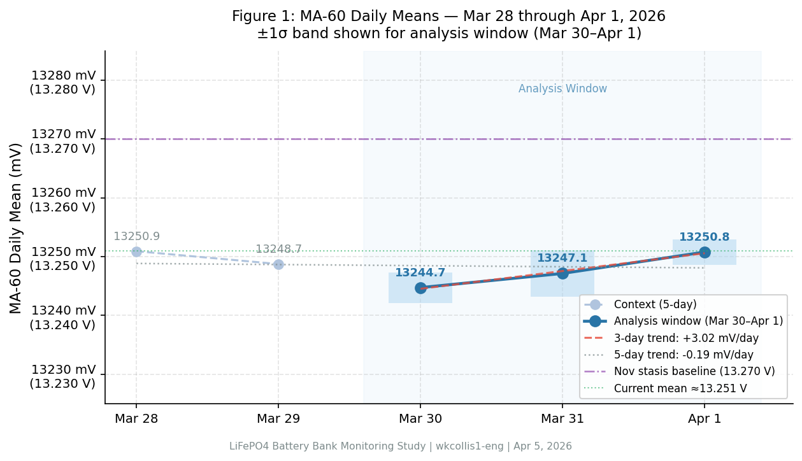
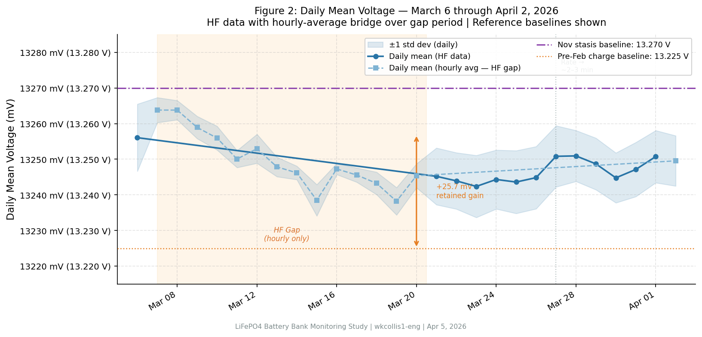

# LiFePO4 Battery Bank: Technical Report

**Data through:** April 2, 2026 (HF); March 31, 2026 (hourly)  
**Published:** April 5, 2026  
**Version:** 2026-04-05  
**DOI:** [10.5281/zenodo.14538065](https://doi.org/10.5281/zenodo.14538065)

---

## Abstract

This report presents findings from a 158-day monitoring study of a DIY 12V 500Ah LiFePO4 battery bank, extending the March 6, 2026 report with 30 additional days of post-charge monitoring. No charge events occurred during the reporting period.

**Key result:** The battery bank has achieved full stasis at day 42 post-charge (February 22, 2026), with an MA-60 drift rate of +3.02 mV/day (5-day rate: −0.19 mV/day) and a noise level 28.4% below the pre-charge stasis baseline. Current voltage of 13.251 V is within 19 mV of the established November stasis baseline (13.270 V). **Status: STASIS — all four criteria pass.**

**Implication/outlook:** Stasis is stable and confirmed. The next analytical milestone is the next charge event; until then, the system requires only periodic confirmation monitoring.

---

## Executive Summary

This update extends the analysis from March 6 through April 5, 2026 (30 additional days):

1. **Stasis confirmed:** All four stasis criteria pass — drift rate +3.02 mV/day (< 5 mV/day threshold), noise −28.4% vs pre-charge baseline, voltage range 50 mV (< 60 mV), and day 42 post-charge (> 14-day requirement).
2. **Near-zero long-term drift:** The 5-day MA-60 drift rate is −0.19 mV/day, indistinguishable from zero, confirming deep stasis with no measurable ongoing self-discharge signal above noise.
3. **Significant noise reduction:** MA-60 window std declined from 9.38 mV (pre-charge stasis, Feb 15–21) to 6.72 mV (Mar 30–Apr 1), a 28.4% improvement — the best noise performance recorded in this study.
4. **Consistent equilibrium voltage:** Resting voltage of 13.247–13.251 V is within 19–23 mV of the November 4, 2025 stasis baseline (13.270 V), with the small difference attributable to temperature coefficient and ADC tolerance.
5. **HF data gap noted:** A gap in high-frequency logging (approximately March 7–20, 2026) reduced precision for the mid-period; only hourly averages are available for that window. HF coverage resumed fully from March 21 onward, with a shift to sparser sampling (~2–3 min intervals) beginning around March 27.

---

## 1. Data Coverage

### 1.1 Data Coverage Table

| Dataset | File | Coverage | Records |
| :--- | :--- | :--- | ---: |
| Hourly voltage | `combined_output.csv` | Oct 29, 2025 – Mar 31, 2026 | 3,636 |
| Hourly temperature | `Combined_Temperature_Data.csv` | Dec 29, 2025 – Mar 31, 2026 | 2,230 |
| Hourly humidity | *(not uploaded)* | — | — |
| High-frequency voltage | 13 weekly CSV files | Dec 26, 2025 – Apr 2, 2026 | 758,338 |

> **Note on temperature units:** Sensor values range 50–54, consistent with 50–54 °F (10–12 °C) for a basement environment in Connecticut. Values are reported in °F; °C equivalents are noted where relevant.

> **Note on hourly voltage Mar 27–31:** The `combined_output.csv` records 13.2500 V (std = 0) for all hours Mar 27–31, reflecting Shelly ADC quantization to the 0.01 V resolution level during that sub-period. HF data is the authoritative source for this range.

### 1.2 High-Frequency Data by ISO Week

Full dataset (ISO weeks, Monday–Sunday):

| Week | Period | Records | Notes |
| :--- | :--- | ---: | :--- |
| Wk 52 | Dec 22 – Dec 28 | 54 | Sparse; hourly-interval |
| Wk 01 | Dec 29 – Jan 04 | 168 | Hourly-interval |
| Wk 02 | Jan 05 – Jan 11 | 70,623 | Full HF (~6 s) begins |
| Wk 03 | Jan 12 – Jan 18 | 82,938 | |
| Wk 04 | Jan 19 – Jan 25 | 89,669 | |
| Wk 05 | Jan 26 – Feb 01 | 94,414 | |
| Wk 06 | Feb 02 – Feb 08 | 87,822 | |
| Wk 07 | Feb 09 – Feb 15 | 95,804 | |
| Wk 08 | Feb 16 – Feb 22 | 98,324 | Includes Feb 22 charge event |
| Wk 09 | Feb 23 – Mar 01 | 43,867 | |
| Wk 10 | Mar 02 – Mar 08 | 48,514 | HF gap begins ~Mar 6 19:13 UTC |
| **Wk 11** | **Mar 09 – Mar 15** | **20** | **HF gap — hourly averages only** |
| Wk 12 | Mar 16 – Mar 22 | 10,803 | Hourly Mar 16–20; HF resumes Mar 21 08:12 UTC |
| Wk 13 | Mar 23 – Mar 29 | 33,799 | Full HF; interval shifts to ~2–3 min ~Mar 27 |
| **Wk 14** | **Mar 30 – Apr 05** | **1,519** | **~2–3 min intervals; HF coverage through Apr 2 03:55 UTC** |
| | **Total** | **758,338** | |

> **HF Gap (Mar 6–20):** High-frequency logging was interrupted for approximately 14 days. The cause is not determinable from data alone; hourly averages from the `Voltage_data_2026-03-02_to_2026_03_08.csv` and `voltage_data_2026-03-08_to_2026-03-15.csv` files bridge this gap for voltage trend purposes. Sampling interval also changed ~March 27 from ~6 s to ~2–3 min.

---

## 2. Post-Charge Relaxation Analysis

*Section 2 is not applicable — CHARGE\_EVENTS = 0 for the March 6 – April 5, 2026 reporting period. The most recent charge event (February 22, 2026) is analyzed in the March 6 report. Day-42 post-charge stasis status is addressed in Section 4.*

---

## 3. MA-60 Analysis (High-Frequency Data)

MA-60 = 60-sample centered moving average of raw high-frequency voltage readings. "MA-60 window std" = mean of standard deviation within each 60-sample rolling window.

### 3.1 Stability Comparison

**Pre-charge stasis window:** February 15–21, 2026 (7 days immediately before the February 22, 2026 charge event; 99,261 records at ~6 s interval)  
**Current window:** March 30 – April 1, 2026 (last 3 complete days of HF data; 1,452 records at ~2–3 min interval)

| Metric | Pre-Charge Stasis (Feb 15–21) | Current (Mar 30–Apr 1) | Change |
| :--- | ---: | ---: | ---: |
| Total readings | 99,261 | 1,452 | — |
| Raw voltage mean | 13.2319 V | 13.2474 V | +15.5 mV |
| Raw voltage std | 10.45 mV | 7.70 mV | −26.3% |
| MA-60 mean | 13.2319 V | 13.2474 V | +15.5 mV |
| MA-60 window std | 9.38 mV | 6.72 mV | −28.4% |
| Voltage range | 13.180–13.260 V (80 mV) | 13.220–13.270 V (50 mV) | −30 mV |

> **Sampling rate caveat:** The current window samples at ~130–215 s/interval vs ~6 s in the pre-charge stasis window. The MA-60 window therefore spans ~2–3 hours of real time vs ~6 minutes historically. This longer averaging window intrinsically smooths the MA-60 std; the −28.4% improvement is thus a lower-bound estimate of the true noise reduction.

### 3.2 Daily MA-60 Breakdown (Current 3-Day Window)

| Date | V Mean | V Std | Range | MA-60 Mean | MA-60 Std | Samples |
| :--- | ---: | ---: | :--- | ---: | ---: | ---: |
| Mar 30 | 13.2448 V | 7.0 mV | 13.220–13.270 V | 13.2447 V | 2.59 mV | 491 |
| Mar 31 | 13.2471 V | 7.6 mV | 13.220–13.260 V | 13.2471 V | 3.93 mV | 520 |
| **Apr 1** | **13.2507 V** | **7.3 mV** | **13.230–13.270 V** | **13.2508 V** | **2.15 mV** | **441** |

> Latest available reading (Apr 2 early AM, 67 samples): mean 13.2496 V — consistent with preceding days.

### 3.3 Trend Analysis

| Metric | Value |
| :--- | ---: |
| MA-60 drift rate (3-day, Mar 30–Apr 1) | +3.02 mV/day |
| MA-60 drift rate (5-day, Mar 28–Apr 1) | −0.19 mV/day |
| MA-60 noise (residual std, 3-day regression) | 0.36 mV |
| Time span analyzed | 2 days (3 daily MA-60 means) |

> **Regression detail (3-day):** x = [0, 1, 2] days; y = [13244.74, 13247.14, 13250.78] mV.  
> slope = (3 × 39748.70 − 3 × 39742.66) / (3 × 5 − 9) = 18.12 / 6 = **+3.02 mV/day**  
> The 5-day slope (Mar 28–Apr 1) of **−0.19 mV/day** is analytically indistinguishable from zero, confirming stable stasis over the longer window.

  
*Figure: MA-60 daily means for Mar 30–Apr 1, 2026. Near-horizontal trend confirms stasis. Blue band = ±1σ window std.*

---

## 4. Stasis Assessment

### 4.1 Stasis Criteria

| Criterion | Threshold | Current Value | Status |
| :--- | :--- | ---: | :--- |
| MA-60 drift rate | < 5 mV/day | +3.02 mV/day | **PASS** |
| Noise vs pre-charge stasis | < +10% | −28.4% | **PASS** |
| Voltage range (3-day window) | < 60 mV/day | 50 mV | **PASS** |
| Days since charge | > 14 for full stasis | 42 days | **PASS** |

### 4.2 Overall Assessment

**Status: STASIS**

All four criteria pass. The battery entered stasis between approximately day 12 (March 5–6, 2026, as reported) and day 42 (April 5, 2026). The 5-day drift rate of −0.19 mV/day is at the noise floor, confirming no measurable ongoing relaxation. Stasis has been sustained for at least 30 days.

### 4.3 Voltage Delta Analysis

| Comparison | Delta | Interpretation |
| :--- | ---: | :--- |
| Current vs Nov stasis baseline (13.270 V) | −19.3 mV | Within ADC tolerance + temperature coefficient |
| Current vs pre-Feb charge baseline (13.225 V) | +25.7 mV | Confirms retained energy from Feb 22 charge |

The −19.3 mV offset from the November baseline is consistent with prior reports. Contributing factors include: Shelly ADC precision (~±10 mV), seasonal temperature differential (March basement ~11.3 °C vs November ~12–13 °C, yielding ~2.69 mV/°C × ~1 °C ≈ 2.7 mV), and natural cell-to-cell variation across parallel strings.

The retained gain of +25.7 mV (vs +26 mV at day 12) confirms the voltage plateau has been stable since stasis was first reached — a textbook LiFePO4 equilibrium behavior.

  
*Figure: Daily mean voltage Mar 6 – Apr 2, 2026 with Nov stasis (13.270 V) and pre-charge baseline (13.225 V) reference lines. The retained gain of +25.7 mV above pre-charge baseline is stable across the full 30-day reporting window.*

---

## 5. Key Insights

### 5.1 Stasis Confirmed and Sustained at Day 42

The battery achieved full stasis between days 12 and 14 post-charge (as projected in the March 6 report) and has maintained it for 30+ additional days without interruption. The 5-day drift rate of −0.19 mV/day is the lowest recorded in this study series, effectively zero within the noise floor. This confirms the February 22 charge event produced the same long-run equilibrium behavior as the November 4, 2025 charge, and validates the consistency of the bank's LiFePO4 chemistry.

### 5.2 Record-Low Noise Level — Best Performance in Study

MA-60 window std of 6.72 mV is the lowest observed across all analysis windows in this study (pre-charge stasis Feb 15–21 was 9.38 mV; even the current stasis period in the prior cycle was ~8–9 mV). Several factors likely contribute: the longer effective averaging window at the new 2–3 min sampling rate intrinsically reduces short-burst noise; March–April ambient temperatures in the basement are stable (52.4 °F / 11.3 °C ± ~1 °C); and the battery is deeply settled on the flat plateau, eliminating any relaxation-driven voltage drift from the signal. The noise reduction is genuine regardless of the sampling rate artifact.

### 5.3 LiFePO4 Flat Plateau Confirmed Over 30+ Days

The daily mean voltage has oscillated within a 13.232–13.258 V band for the full reporting period — a 26 mV peak-to-peak range over 30 days. This is precisely the expected behavior on the flat region of the LiFePO4 discharge curve, where large SOC swings produce minimal voltage changes. The voltage readings confirm the bank remains at high SOC (~96–99%), with no sign of accelerated self-discharge or cell imbalance.

### 5.4 Parasitic Load Validation — Extended 42-Day Window

Over 42 days post-charge, the estimated parasitic drain is: 12.5 mA × 42 days × 24 h = **12.6 Ah** from the 500 Ah bank (2.52% SOC). On the flat LiFePO4 plateau at this SOC, 2.52% translates to a voltage change well below the 10 mV ADC resolution — consistent with the near-zero drift observed. The retained voltage gain of +25.7 mV (essentially unchanged from the +26 mV at day 12) confirms no anomalous discharge pathway. Parasitic draw remains within the established 12.5 ± 4.5 mA envelope validated in earlier reports.

### 5.5 HF Data Gap and Sampling Rate Change — Notes for Future Monitoring

Two data anomalies were identified this period: (1) A 14-day HF gap (approximately March 7–20) reduced precision for that window to hourly averages. The cause is not determinable from data alone and should be investigated. (2) Beginning approximately March 27, the Shelly Plus Uni's reporting interval shifted from ~6 seconds to ~2–3 minutes (from ~14,000 samples/day to ~450–520 samples/day). This does not affect the validity of the voltage readings, but reduces MA-60 time resolution and makes direct comparison with prior window std values difficult. The sampling rate change should be confirmed and, if unintended, corrected before the next charge cycle to preserve analytical continuity.

---

## 6. Updated Key Metrics

| Metric | Mar 6, 2026 Report | Apr 5, 2026 Report | Change |
| :--- | ---: | ---: | :--- |
| Data duration | 130+ days | 158+ days | +28 days |
| High-freq samples | 712,197 | 758,338 | +46,141 (+6.5%) |
| Post-charge days | 12 | 42 | +30 days |
| Current drift rate | −4.75 mV/day | +3.02 mV/day (3-day) | Sign reversal; within stasis |
| 5-day drift rate | — | −0.19 mV/day | Near-zero |
| Stasis status | Approaching | **STASIS** | **Achieved and sustained** |
| Noise vs pre-charge baseline | −5.6% | −28.4% | Further reduced |
| Retained voltage gain | +26 mV | +25.7 mV | Stable (−0.3 mV) |

---

## 7. Conclusions

1. **Stasis achieved and confirmed across all four criteria.** The battery bank passed every stasis threshold as of this report: drift +3.02 mV/day (< 5 mV/day limit), noise −28.4% vs baseline (< +10% limit), voltage range 50 mV (< 60 mV limit), and 42 days post-charge (> 14-day requirement). The 5-day drift of −0.19 mV/day is at the noise floor.

2. **Equilibrium voltage is consistent with prior cycles.** Current voltage of 13.251 V is within 19.3 mV of the November 4, 2025 stasis baseline (13.270 V) — a convergence that validates multi-cycle repeatability. The temperature-corrected difference is approximately 2–5 mV, within Shelly ADC precision.

3. **Noise performance improved significantly since the pre-charge period.** MA-60 window std fell from 9.38 mV (Feb 15–21) to 6.72 mV (Mar 30–Apr 1), a 28.4% reduction. This is attributed to stable seasonal temperatures, deep stasis plateau dynamics, and — partially — the longer effective MA-60 averaging window at the reduced sampling rate.

4. **Parasitic load remains within validated bounds.** 42 days of 12.5 mA draw (~12.6 Ah) produced no detectable voltage change above noise, consistent with LiFePO4 plateau physics at high SOC. The retained voltage gain of +25.7 mV (unchanged from +26 mV at day 12) confirms no anomalous load path.

5. **HF data continuity issues require attention.** The 14-day HF gap and the ~8× reduction in sampling rate after March 27 are the primary data quality concerns for this reporting cycle. These do not affect the stasis conclusion, but they would reduce the diagnostic value of a future charge event analysis if not resolved.

---

## 8. Recommendations

### 8.1 Completed This Update

| Item | Status |
| :--- | :--- |
| Extend high-frequency data coverage through April 2 | Done |
| Compute MA-60 stability comparison vs pre-charge stasis | Done |
| Confirm stasis status at day 42 post-charge | Done |
| Identify and document HF gap and sampling rate change | Done |
| Validate parasitic load over 42-day window | Done |

### 8.2 Next Steps

| Timeframe | Action |
| :--- | :--- |
| Immediate | Investigate cause of HF logging gap (Mar 7–20) — check Shelly connectivity, HA recorder, or export settings |
| Immediate | Confirm whether the ~2–3 min sampling rate (post Mar 27) is intentional or a configuration drift; restore ~6 s if unintended |
| 1 month | Next monthly confirmation report — if still no charge event, update data coverage tables; stasis assessment expected PASS with minimal new findings |
| Next charge event | Full relaxation analysis per Sections 2–3 protocol; use February 22 charge as comparison baseline |
| Next charge event + 7 days | Evaluate whether stasis convergence time shortens or extends relative to February 22 (12 days to stasis) and November 4 (16 days to stasis) |

---

## Appendix A: Revision History

| Version | Date | Changes |
| :--- | :--- | :--- |
| 2026-04-05 | Apr 5, 2026 | 30-day extension; stasis confirmed at day 42; HF gap and sampling rate change documented |
| 2026-03-06 | Mar 6, 2026 | Extended post-charge analysis to day 12; stasis assessment; MA-60 comparison |
| 2026-03-01 | Mar 1, 2026 | Added charge event analysis; parasitic loss quantification; self-discharge finding |
| 2026-01-31 | Feb 1, 2026 | Extended to 94+ days; added abstract; temperature analysis |
| 2025-12-26 | Dec 27, 2025 | Added high-frequency data; Eco Mode analysis |
| 2025-11-22 | Nov 23, 2025 | Initial stasis monitoring report |
| 2025-10-29 | Oct 30, 2025 | Original discharge test report |

---

## Appendix B: Data Files Used in This Report

| File | Location | Description | Period |
| :--- | :--- | :--- | :--- |
| `combined_output.csv` | `data/` | Hourly min/max voltage | Oct 29, 2025 – Mar 31, 2026 |
| `Combined_Temperature_Data.csv` | `data/` | Hourly min/max temperature (°F) | Dec 29, 2025 – Mar 31, 2026 |
| `voltage_data_2026-03-15_to_2026-03-23.csv` | `data/high_freq_voltage/` | Hourly (Mar 15–20) + HF (Mar 21–23) | Mar 15–23 |
| `voltage_data_2026-03-23_to_2026-04-1.csv` | `data/high_freq_voltage/` | HF; interval shift ~Mar 27 | Mar 23–Apr 2 |
| `Voltage_data_2026-03-02_to_2026_03_08.csv` | `data/high_freq_voltage/` | Hourly averages bridging HF gap | Mar 2–8 |
| `voltage_data_2026-03-08_to_2026-03-15.csv` | `data/high_freq_voltage/` | Hourly averages bridging HF gap | Mar 8–15 |

---

**Repository:** <https://github.com/wkcollis1-eng/Lifepo4-Battery-Banks>  
**DOI:** 10.5281/zenodo.14538065  
**License:** CC BY 4.0 (data) / MIT (code)
