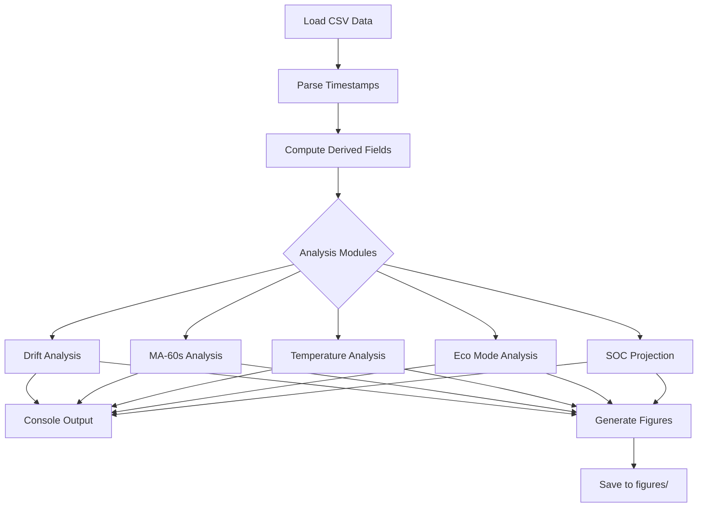

# 🐍 Scripts

Analysis code for the LiFePO₄ battery monitoring study.

---

## Contents

- [Files](#files)
- [Quick Start](#quick-start)
- [Pipeline Overview](#pipeline-overview)
- [Configuration](#configuration)
- [Output](#output)
- [Modifying for Your Data](#modifying-for-your-data)
- [Code Style](#code-style)
- [Dependencies](#dependencies)

---

## Files

| File | Description | Language |
|:-----|:------------|:---------|
| `ina228_export.py` | Build the published INA228 datasets from InfluxDB | Python 3.9+ |
| `ina228_analysis.py` | INA228-era figures and headline numbers, from repo data only | Python 3.9+ |
| `update_monthly_metrics.py` | Rebuild `data/monthly_metrics.csv` across both instrument eras | Python 3.9+ |
| `sem_export.py` | Build the SEM outage / coincident-peak datasets from InfluxDB | Python 3.9+ |
| `outage_analysis.py` | Reproduce the 2026-07-04 outage and coincident-peak figures | Python 3.9+ |
| `lifepo4_analysis.py` | Shelly-era analysis pipeline | Python 3.8+ |
| `parse_shelly_export.py` | Parse raw Shelly HA exports | Python 3.8+ |
| `update_voltage_chart.py` | Regenerate `voltage_chart.html` | Python 3.8+ |
| `smoke_test.py` | CI sanity checks | Python 3.8+ |

### INA228 era

`ina228_analysis.py` reads **only files that ship in this repository**, so every
figure and number in the 2026-08-26 report is reproducible with no access to the
Home Assistant host:

```bash
python scripts/ina228_analysis.py        # figures -> figures/, numbers -> stdout
```

`ina228_export.py` is the one script that needs the host. It reads InfluxDB
credentials from the HA `secrets.yaml` (environment variables win) and only ever
issues `SELECT` — use a read-only Influx user:

```bash
HA_CONFIG=H:/ python scripts/ina228_export.py
```

> [!NOTE]
> The raw 2 s series is ~130 MB and is not versioned. The export publishes hourly
> and daily aggregates, 1-minute MA-60s means for the stasis window (gzipped), the
> three-way coulomb ledger, the two-instrument cross-check, and full 2 s
> resolution for the four charge/discharge event windows — see
> [`data/README.md`](../data/README.md).

---

## Quick Start

```bash
# From repository root
cd Lifepo4-Battery-Banks

# Install dependencies
pip install -r requirements.txt

# Run analysis
python scripts/lifepo4_analysis.py
```

**Expected runtime:** ~30 seconds (depends on data size)

---

## Pipeline Overview

The analysis script processes data through these stages:



### Analysis Modules

| Module | Purpose | Output |
|:-------|:--------|:-------|
| DRIFT ANALYSIS | OLS regression on daily means | fig1, fig5 |
| MA-60 SECONDS | Time-based rolling mean | fig2, fig6 |
| TEMPERATURE-VOLTAGE | Two-factor regression | fig4 |
| ECO MODE | Pre/post transition comparison | fig3 |
| SOC & STORAGE | Endurance projection | fig7 |

---

## Configuration

Key parameters are defined at the top of `lifepo4_analysis.py`:

```python
# =============================================================
# CONFIGURATION
# =============================================================

# File paths
VOLTAGE_FILE = 'data/combined_output.csv'
TEMP_FILE = 'data/combined_temperature.csv'
HF_FILE = 'data/high_freq_voltage/'  # Weekly consolidated files

# Date parsing
DATE_FORMAT = '%d/%m/%Y %H:%M'

# Stasis period definition
STASIS_START = '2025-11-22'
STASIS_END = '2026-02-21'

# Eco Mode transition
ECO_MODE_DATETIME = '2025-12-23 15:40:00'

# Output
FIGURE_DPI = 150
OUTPUT_DIR = 'figures/'
```

---

## Output

### Console Output

The script prints analysis results to stdout:

```
================================================================================
DRIFT ANALYSIS
================================================================================
Full stasis period: 2025-11-22 to 2026-02-21 (92 days)
  OLS slope: -0.575 mV/day
  R²: 0.876
  Total change: -46.0 mV

Last 30 days: 2026-01-23 to 2026-02-21
  OLS slope: -0.454 mV/day
  R²: 0.132
  Rate reduction: 21.0%

================================================================================
MA-60 SECONDS ANALYSIS
================================================================================
Global statistics (663,683 samples):
  Raw σ: 10.38 mV
  MA-60s σ: 5.98 mV
  Noise reduction: 42.5%

...
```

### Generated Figures

Figures are saved to `figures/` directory:

| Figure | File |
|:-------|:-----|
| Voltage timeline | `fig1_voltage_timeline.png` |
| MA-60s comparison | `fig2_ma60_comparison.png` |
| Spread analysis | `fig3_spread_analysis.png` |
| Temperature-voltage | `fig4_temperature_voltage.png` |
| Drift flattening | `fig5_drift_flattening.png` |
| MA-60s segments | `fig6_ma60_segments.png` |
| SOC projection | `fig7_soc_projection.png` |

---

## Modifying for Your Data

### Step 1: Update File Paths

```python
# Point to your data files
VOLTAGE_FILE = 'path/to/your/voltage_data.csv'
TEMP_FILE = 'path/to/your/temperature_data.csv'
```

### Step 2: Adjust Column Names

If your CSV has different column names:

```python
# Your column mapping
VOLTAGE_COL = 'voltage'      # or 'state', 'value', etc.
MIN_COL = 'min_voltage'      # or 'Min', 'minimum', etc.
MAX_COL = 'max_voltage'      # or 'Max', 'maximum', etc.
TIMESTAMP_COL = 'timestamp'  # or 'datetime', 'time', etc.
```

### Step 3: Adjust Date Parsing

```python
# Common format strings
DATE_FORMAT = '%Y-%m-%d %H:%M:%S'  # ISO format
DATE_FORMAT = '%d/%m/%Y %H:%M'     # British format (current)
DATE_FORMAT = '%m/%d/%Y %H:%M'     # US format
DATE_FORMAT = '%Y-%m-%dT%H:%M:%SZ' # ISO 8601 with timezone
```

### Step 4: Update Time Windows

```python
# Adjust to your monitoring period
STASIS_START = '2025-11-22'  # When monitoring began
STASIS_END = '2026-02-21'    # Data cutoff (before Feb 22 charge event)

# If you have an Eco Mode or similar transition
ECO_MODE_DATETIME = '2025-12-23 15:40:00'
```

### Step 5: Handle Timezone

```python
import pytz

# Set your local timezone
LOCAL_TZ = pytz.timezone('America/New_York')

# Or use UTC
LOCAL_TZ = pytz.UTC
```

---

## Code Style

This project follows these conventions:

| Aspect | Convention |
|:-------|:-----------|
| Python version | 3.8+ compatible |
| Style guide | PEP 8 |
| Variable names | Descriptive, snake_case |
| Functions | Docstrings for all public functions |
| Comments | Explain "why", not "what" |

### Example Function

```python
def compute_drift_rate(daily_means: pd.Series, start_date: str, end_date: str) -> dict:
    """
    Compute OLS drift rate for a given time window.

    Parameters
    ----------
    daily_means : pd.Series
        Daily mean voltage values with datetime index
    start_date : str
        Window start date (YYYY-MM-DD)
    end_date : str
        Window end date (YYYY-MM-DD)

    Returns
    -------
    dict
        Contains 'slope_mv_day', 'r_squared', 'p_value', 'std_error'
    """
    window = daily_means[start_date:end_date]
    days = (window.index - window.index[0]).days
    slope, intercept, r, p, se = stats.linregress(days, window.values)

    return {
        'slope_mv_day': slope * 1000,
        'r_squared': r ** 2,
        'p_value': p,
        'std_error': se * 1000
    }
```

---

## Dependencies

### requirements.txt

```
pandas>=1.3.0
numpy>=1.20.0
scipy>=1.7.0
matplotlib>=3.4.0
seaborn>=0.11.0
statsmodels>=0.12.0
```

### Installation

```bash
# Standard installation
pip install -r requirements.txt

# Or with conda
conda install pandas numpy scipy matplotlib seaborn statsmodels
```

### Version Compatibility

| Package | Minimum | Tested |
|:--------|:--------|:-------|
| Python | 3.8 | 3.10 |
| pandas | 1.3.0 | 2.0.0 |
| numpy | 1.20.0 | 1.24.0 |
| scipy | 1.7.0 | 1.10.0 |
| matplotlib | 3.4.0 | 3.7.0 |
| seaborn | 0.11.0 | 0.12.0 |
| statsmodels | 0.12.0 | 0.14.0 |

---

## License

MIT License — see [/LICENSE-CODE](../LICENSE-CODE)

---

## See Also

- [Methodology](../docs/methodology.md) — Analytical methods explained
- [Evidence Map](../docs/evidence_map.md) — Code-to-claim traceability
- [Data Dictionary](../data/README.md) — Input data format
